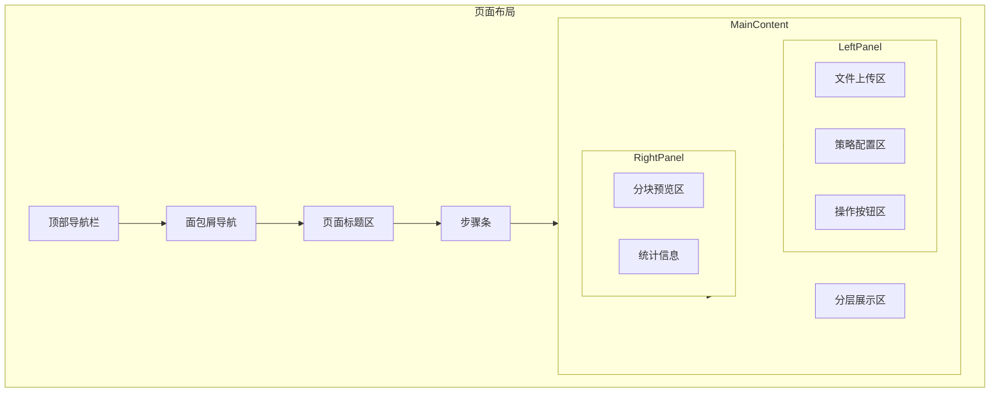
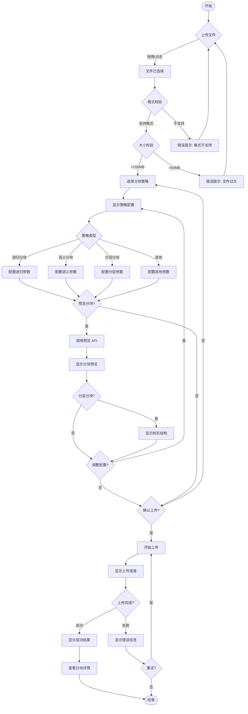
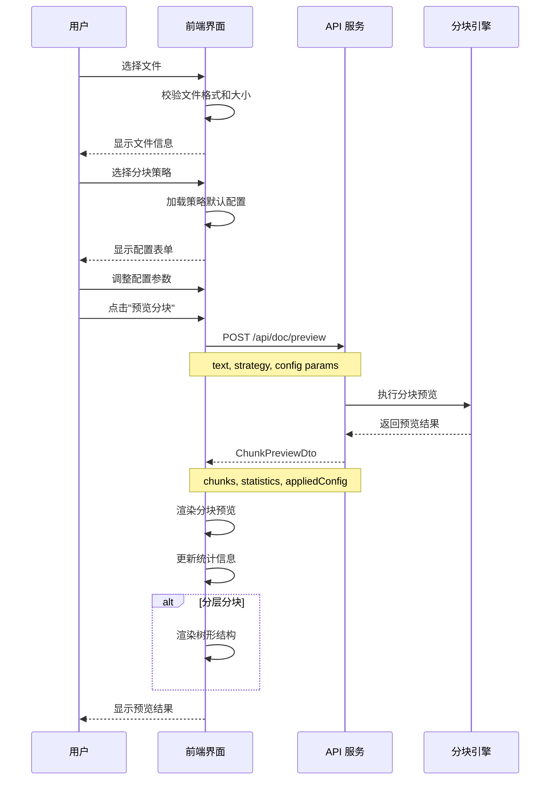
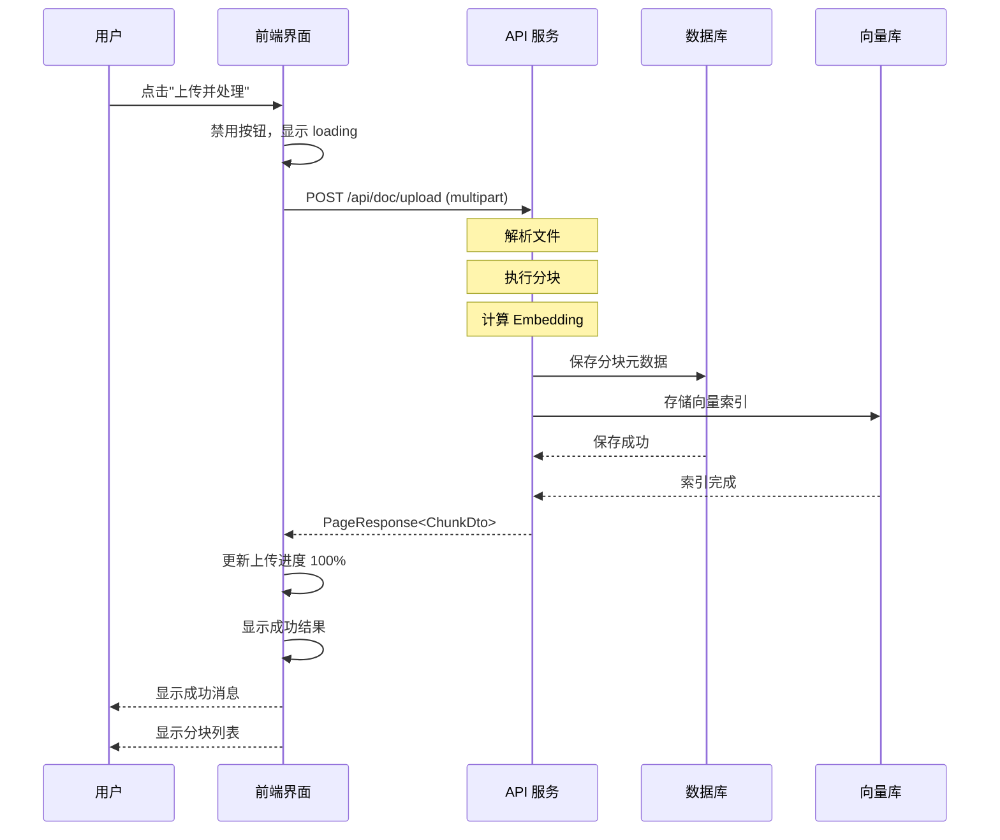

# RAG 文档上传页面 UI 设计文档

**文档版本**: v1.0
**创建日期**: 2026-03-22
**设计师**: UI Designer
**状态**: 设计完成

---

## 1. 页面整体布局

### 1.1 页面结构图（ASCII）

```
+------------------------------------------------------------------+
|                         顶部导航栏                                |
+------------------------------------------------------------------+
|                                                                    |
|  [面包屑导航] 首页 > 文档管理 > 文档上传                           |
|                                                                    |
|  +------------------------------------------------------------+   |
|  |                    页面标题区域                            |   |
|  |  文档上传                                         [帮助]   |   |
|  |  上传文档并配置智能分块参数                                |   |
|  +------------------------------------------------------------+   |
|                                                                    |
|  +------------------------------------------------------------+   |
|  |                                                            |   |
|  |  [步骤条]  1.上传文件  ---  2.配置分块  ---  3.预览确认   |   |
|  |                                                            |   |
|  +------------------------------------------------------------+   |
|                                                                    |
|  +--------------------------------+  +------------------------+   |
|  |                                |  |                        |   |
|  |        左侧区域                |  |      右侧区域          |   |
|  |                                |  |                        |   |
|  |  +--------------------------+  |  |  +------------------+  |   |
|  |  |     文件上传区           |  |  |  |   分块预览区     |  |   |
|  |  |     (拖拽/点击)          |  |  |  |                  |  |   |
|  |  +--------------------------+  |  |  |   [分块卡片列表] |  |   |
|  |                                |  |  |                  |  |   |
|  |  +--------------------------+  |  |  |   - 分块 1       |  |   |
|  |  |     分块策略配置         |  |  |  |   - 分块 2       |  |   |
|  |  |                          |  |  |  |   - 分块 3       |  |   |
|  |  |  策略选择: [下拉框]      |  |  |  |   ...            |  |   |
|  |  |                          |  |  |  |                  |  |   |
|  |  |  [动态参数配置区域]      |  |  |  +------------------+  |   |
|  |  |  根据选择的策略显示      |  |  |                        |   |
|  |  |  不同的配置表单          |  |  |  +------------------+  |   |
|  |  |                          |  |  |  |   统计信息       |  |   |
|  |  |  [高级配置] (可折叠)     |  |  |  |                  |  |   |
|  |  +--------------------------+  |  |  |  分块数: 15      |  |   |
|  |                                |  |  |  平均大小: 487   |  |   |
|  |  +--------------------------+  |  |  +------------------+  |   |
|  |  |     操作按钮区           |  |  |                        |   |
|  |  |  [预览分块] [上传并处理] |  |  |                        |   |
|  |  +--------------------------+  |  |                        |   |
|  +--------------------------------+  +------------------------+   |
|                                                                    |
|  +------------------------------------------------------------+   |
|  |                    分层展示区 (条件显示)                   |   |
|  |           仅在选择"分层分块"策略时显示                    |   |
|  |                                                            |   |
|  |  [树形结构] 展示父子分块关系                               |   |
|  |                                                            |   |
|  +------------------------------------------------------------+   |
|                                                                    |
+------------------------------------------------------------------+
```

### 1.2 响应式布局说明

| 断点 | 布局方式 | 说明 |
|------|---------|------|
| < 768px (Mobile) | 单列垂直布局 | 左右区域改为上下堆叠，配置区在上，预览区在下 |
| 768px - 1024px (Tablet) | 双列布局 | 左侧 60%，右侧 40%，预览区简化显示 |
| > 1024px (Desktop) | 双列布局 | 左侧 50%，右侧 50%，完整显示所有功能 |

### 1.3 页面结构 Mermaid 图



---

## 2. 核心交互区域设计

### 2.1 文档上传区

#### 2.1.1 拖拽上传区域设计

```
+------------------------------------------------------+
|                                                       |
|                    [InboxOutlined]                   |
|                    (大图标, 64px)                     |
|                                                       |
|            点击或拖拽文件到此区域上传                 |
|                                                       |
|     支持格式: .txt .md .pdf .docx (最大 50MB)        |
|                                                       |
|  +-----------------------------------------------+   |
|  |  [已选择文件]                                 |   |
|  |  document.pdf  (2.3 MB)              [删除]  |   |
|  |  [=============================] 75%          |   |
|  +-----------------------------------------------+   |
|                                                       |
+------------------------------------------------------+
```

#### 2.1.2 状态设计

| 状态 | 视觉表现 |
|------|---------|
| 默认 | 虚线边框，灰色背景，图标和文字居中 |
| 拖拽悬停 | 实线边框，主题色高亮，背景变浅蓝 |
| 上传中 | 显示文件名和进度条，禁用拖拽 |
| 上传成功 | 显示绿色对勾，文件信息展示 |
| 上传失败 | 红色边框，显示错误信息，提供重试按钮 |

#### 2.1.3 组件实现

```jsx
<Dragger
  name="file"
  multiple={false}
  beforeUpload={beforeUpload}
  accept=".txt,.md,.pdf,.docx"
  disabled={uploading}
  maxCount={1}
>
  <p className="ant-upload-drag-icon">
    <InboxOutlined style={{ fontSize: 64, color: '#1890ff' }} />
  </p>
  <p className="ant-upload-text">点击或拖拽文件到此区域上传</p>
  <p className="ant-upload-hint">
    支持格式: .txt .md .pdf .docx (最大 50MB)
  </p>
</Dragger>
```

### 2.2 分块策略配置区

#### 2.2.1 策略选择器

```
+------------------------------------------------------+
|  分块策略                                             |
|  +--------------------------------------------------+ |
|  |  [图标] 递归分块                     [推荐]     | |
|  +--------------------------------------------------+ |
|  |  [图标] 语义分块                                 | |
|  +--------------------------------------------------+ |
|  |  [图标] 分层分块                                 | |
|  +--------------------------------------------------+ |
|  |  [图标] 固定长度分块                             | |
|  +--------------------------------------------------+ |
|  |  [图标] 混合分块                                 | |
|  +--------------------------------------------------+ |
|  |  [图标] 自定义规则                               | |
|  +--------------------------------------------------+ |
+------------------------------------------------------+
```

#### 2.2.2 策略选项设计

```jsx
const CHUNK_STRATEGIES = [
  {
    value: 'recursive',
    label: '递归分块',
    description: '按分隔符优先级递归分割',
    icon: <ApartmentOutlined />,
    badge: '推荐',
    requiresEmbedding: false
  },
  {
    value: 'true_semantic',
    label: '语义分块',
    description: '基于 Embedding 相似度分割',
    icon: <MindOutlined />,
    badge: null,
    requiresEmbedding: true
  },
  {
    value: 'hierarchical',
    label: '分层分块',
    description: '父子结构，大块检索小块生成',
    icon: <PartitionOutlined />,
    badge: '高级',
    requiresEmbedding: true
  },
  {
    value: 'fixed_length',
    label: '固定长度分块',
    description: '按固定字符数分块',
    icon: <UnorderedListOutlined />,
    badge: null,
    requiresEmbedding: false
  },
  {
    value: 'hybrid',
    label: '混合分块',
    description: '结合固定长度和语义分块',
    icon: <MergeCellsOutlined />,
    badge: null,
    requiresEmbedding: true
  },
  {
    value: 'custom_rule',
    label: '自定义规则',
    description: '按自定义分隔符分块',
    icon: <ToolOutlined />,
    badge: null,
    requiresEmbedding: false
  }
];
```

#### 2.2.3 递归分块参数配置

```
+------------------------------------------------------+
|  递归分块参数                                         |
|                                                      |
|  目标块大小 (字符数)                                 |
|  +------------------------------------------------+  |
|  |  [========●===================] 500          |  |
|  |  100                              4000       |  |
|  +------------------------------------------------+  |
|  提示: 建议值 300-800，平衡语义完整性和检索精度      |
|                                                      |
|  块重叠大小 (字符数)                                 |
|  +------------------------------------------------+  |
|  |  [==============●=============] 50           |  |
|  |  0                               250        |  |
|  +------------------------------------------------+  |
|                                                      |
|  最小块大小 (字符数)                                 |
|  +------------------------------------------------+  |
|  |  50                                          |  |
|  +------------------------------------------------+  |
|                                                      |
|  是否保留分隔符  [开关 ●]                           |
|                                                      |
|  +------------------------------------------------+  |
|  |  [高级配置] (点击展开)                        |  |
|  +------------------------------------------------+  |
```

**高级配置展开后：**

```
+------------------------------------------------------+
|  [- 高级配置]                                        |
|                                                      |
|  分隔符优先级 (从高到低)                             |
|  +------------------------------------------------+  |
|  |  1. \n\n\n (章节分隔)            [删除]      |  |
|  |  2. \n\n (段落分隔)              [删除]      |  |
|  |  3. \n (行分隔)                  [删除]      |  |
|  |  4. 。 (中文句号)                [删除]      |  |
|  |  5. . (英文句号)                 [删除]      |  |
|  |  [+ 添加分隔符]                              |  |
|  +------------------------------------------------+  |
|                                                      |
|  [恢复默认分隔符]                                    |
+------------------------------------------------------+
```

#### 2.2.4 语义分块参数配置

```
+------------------------------------------------------+
|  语义分块参数                                         |
|                                                      |
|  相似度阈值                                          |
|  +------------------------------------------------+  |
|  |  [================●============] 0.45        |  |
|  |  0.0                            1.0          |  |
|  +------------------------------------------------+  |
|  提示: 值越小，分块越细；值越大，分块越粗            |
|                                                      |
|  是否使用动态阈值  [开关 ●]                         |
|                                                      |
|  百分位阈值 (动态模式下生效)                         |
|  +------------------------------------------------+  |
|  |  [================●============] 0.8         |  |
|  |  0.5                            0.95         |  |
|  +------------------------------------------------+  |
|                                                      |
|  断点检测方法                                        |
|  +------------------------------------------------+  |
|  |  ○ 百分位数 (推荐)                           |  |
|  |  ○ 梯度检测                                   |  |
|  |  ○ 固定阈值                                   |  |
|  |  ○ 四分位距                                   |  |
|  +------------------------------------------------+  |
|                                                      |
|  块大小限制                                          |
|  +----------------+  +----------------+              |
|  | 最小: 100     |  | 最大: 2000     |              |
|  +----------------+  +----------------+              |
|                                                      |
|  +------------------------------------------------+  |
|  |  [高级配置] (点击展开)                        |  |
|  +------------------------------------------------+  |
```

#### 2.2.5 分层分块参数配置

```
+------------------------------------------------------+
|  分层分块参数                                         |
|                                                      |
|  +----------------------------------------------+    |
|  |  [图示] 父块 (2000字符)                      |    |
|  |    +--------------------------------------+  |    |
|  |    | 子块1 (200字符) | 子块2 | 子块3 |...|  |    |
|  |    +--------------------------------------+  |    |
|  +----------------------------------------------+    |
|                                                      |
|  父块配置                                            |
|  +------------------------------------------------+  |
|  |  父块大小 (字符数)                            |  |
|  |  [====================●=======] 2000         |  |
|  |  1000                        8000            |  |
|  +------------------------------------------------+  |
|                                                      |
|  |  父块重叠 (字符数)                            |  |
|  |  [============●===================] 200      |  |
|  |  0                            500            |  |
|  +------------------------------------------------+  |
|                                                      |
|  子块配置                                            |
|  +------------------------------------------------+  |
|  |  子块大小 (字符数)                            |  |
|  |  [================●============] 200         |  |
|  |  100                        1000             |  |
|  +------------------------------------------------+  |
|                                                      |
|  |  子块重叠 (字符数)                            |  |
|  |  [================●============] 20          |  |
|  |  0                           50              |  |
|  +------------------------------------------------+  |
|                                                      |
|  子块分割策略                                        |
|  +------------------------------------------------+  |
|  |  ○ 递归分割 (推荐)                           |  |
|  |  ○ 按句子分割                                 |  |
|  |  ○ 固定长度分割                               |  |
|  +------------------------------------------------+  |
|                                                      |
|  是否为父块生成 Embedding  [开关 ○]                  |
|  提示: 开启后父块也可用于检索，但会增加存储开销      |
+------------------------------------------------------+
```

### 2.3 分块预览区

#### 2.3.1 预览区布局

```
+------------------------------------------------------+
|  分块预览                         [刷新] [展开全部] |
|  +------------------------------------------------+  |
|  |  分块 1 / 15                     487 字符    |  |
|  |  +------------------------------------------+ |  |
|  |  | 第一章 系统概述                          | |  |
|  |  |                                          | |  |
|  |  | 本文档描述了 RAG 系统的架构设计，包含    | |  |
|  |  | 文档处理、向量化存储、智能检索等核心     | |  |
|  |  | 模块...                                  | |  |
|  |  +------------------------------------------+ |  |
|  |                               [展开] [详情] |  |
|  +------------------------------------------------+  |
|                                                      |
|  +------------------------------------------------+  |
|  |  分块 2 / 15                     512 字符    |  |
|  |  +------------------------------------------+ |  |
|  |  | 第二章 核心组件                          | |  |
|  |  |                                          | |  |
|  |  | 系统包含以下核心组件：                   | |  |
|  |  | 1. 文档解析服务                          | |  |
|  |  | 2. 分块策略引擎...                       | |  |
|  |  +------------------------------------------+ |  |
|  |                               [展开] [详情] |  |
|  +------------------------------------------------+  |
|                                                      |
|  [加载更多...]                                       |
|                                                      |
+------------------------------------------------------+
```

#### 2.3.2 统计信息面板

```
+------------------------------------------------------+
|  统计信息                                            |
|  +----------------------------------------------+    |
|  |  总分块数                                    |    |
|  |  15                                          |    |
|  +----------------------------------------------+    |
|                                                      |
|  +----------------------------------------------+    |
|  |  块大小分布                                  |    |
|  |                                              |    |
|  |  平均: 487 字符                              |    |
|  |  最小: 120 字符                              |    |
|  |  最大: 980 字符                              |    |
|  |                                              |    |
|  |  [柱状图分布]                                |    |
|  |  100-300  ████████ 3                         |    |
|  |  300-500  ████████████████████ 6             |    |
|  |  500-700  ██████████████ 4                   |    |
|  |  700-900  ████████ 2                         |    |
|  +----------------------------------------------+    |
+------------------------------------------------------+
```

### 2.4 分层展示区（分层分块专用）

#### 2.4.1 树形结构展示

```
+------------------------------------------------------+
|  分层结构预览                        [视图切换: 树形] |
|                                                      |
|  +----------------------------------------------+    |
|  |  ▼ 父块 1 (2000字符, 10个子块)              |    |
|  |    │                                         |    |
|  |    ├─ 子块 1.1 (200字符)  位置: 0-200       |    |
|  |    ├─ 子块 1.2 (200字符)  位置: 180-380     |    |
|  |    ├─ 子块 1.3 (195字符)  位置: 360-555     |    |
|  |    ├─ 子块 1.4 (210字符)  位置: 535-745     |    |
|  |    ├─ ...                                    |    |
|  |    └─ 子块 1.10 (188字符) 位置: 1812-2000   |    |
|  |                                              |    |
|  |  ▶ 父块 2 (2000字符, 10个子块)              |    |
|  |                                              |    |
|  |  ▶ 父块 3 (1856字符, 9个子块)               |    |
|  |                                              |    |
|  +----------------------------------------------+    |
|                                                      |
|  分层统计                                            |
|  +----------------------------------------------+    |
|  |  父块数: 3     子块数: 29                    |    |
|  +----------------------------------------------+    |
|                                                      |
+------------------------------------------------------+
```

#### 2.4.2 层级导航

```
+------------------------------------------------------+
|  层级导航                                            |
|                                                      |
|  [全部] [父块] [子块]                               |
|                                                      |
|  父块范围: 1-3 / 子块范围: 1-29                     |
|                                                      |
|  快速跳转:                                           |
|  +----------------------------------------------+    |
|  |  父块 [下拉选择 ▼]                           |    |
|  +----------------------------------------------+    |
|                                                      |
+------------------------------------------------------+
```

#### 2.4.3 点击交互

| 操作 | 行为 |
|------|------|
| 点击父块 | 展开显示所有子块，右侧显示父块内容详情 |
| 点击子块 | 高亮选中，右侧显示子块内容详情 |
| 悬停父块 | 显示 tooltip: 包含块大小、子块数量、位置范围 |
| 悬停子块 | 显示 tooltip: 包含块大小、所属父块、位置范围 |

---

## 3. 交互流程图

### 3.1 完整用户操作流程



### 3.2 分块预览流程



### 3.3 上传确认流程



---

## 4. 组件清单

### 4.1 需要开发的新组件

| 组件名 | 路径 | 功能描述 |
|--------|------|---------|
| `ChunkStrategySelector` | `components/ChunkStrategySelector` | 分块策略选择器，支持图标、描述、徽章 |
| `RecursiveChunkConfig` | `components/ChunkConfig/RecursiveChunkConfig` | 递归分块配置表单 |
| `SemanticChunkConfig` | `components/ChunkConfig/SemanticChunkConfig` | 语义分块配置表单 |
| `HierarchicalChunkConfig` | `components/ChunkConfig/HierarchicalChunkConfig` | 分层分块配置表单 |
| `SeparatorEditor` | `components/SeparatorEditor` | 分隔符优先级编辑器 |
| `ChunkPreview` | `components/ChunkPreview` | 分块预览卡片列表 |
| `ChunkPreviewCard` | `components/ChunkPreviewCard` | 单个分块预览卡片 |
| `ChunkStatistics` | `components/ChunkStatistics` | 分块统计信息面板 |
| `HierarchicalTree` | `components/HierarchicalTree` | 分层结构树形展示 |
| `SizeDistributionChart` | `components/SizeDistributionChart` | 块大小分布柱状图 |
| `UploadSteps` | `components/UploadSteps` | 上传步骤条组件 |
| `AdvancedConfigPanel` | `components/AdvancedConfigPanel` | 高级配置折叠面板 |

### 4.2 可复用的 Ant Design 组件

| 组件 | 用途 |
|------|------|
| `Upload.Dragger` | 文件拖拽上传 |
| `Card` | 卡片容器 |
| `Form` | 表单布局 |
| `InputNumber` | 数字输入 |
| `Slider` | 参数滑块调节 |
| `Switch` | 开关选项 |
| `Select` | 下拉选择 |
| `Radio.Group` | 单选组 |
| `Collapse` | 高级配置折叠 |
| `Tree` | 分层树形结构 |
| `Progress` | 上传进度 |
| `Steps` | 步骤条 |
| `Alert` | 提示信息 |
| `Tooltip` | 悬停提示 |
| `Button` | 操作按钮 |
| `Spin` | 加载状态 |
| `Empty` | 空状态 |
| `Tag` | 标签 |
| `Badge` | 徽章 |
| `Statistic` | 统计数值展示 |
| `Drawer` | 详情抽屉 |
| `Modal` | 确认对话框 |

### 4.3 组件层次结构

```
DocumentUpload (页面)
├── UploadSteps
│   └── Steps.Step x3
├── Row (左侧面板)
│   ├── Card (文件上传区)
│   │   └── Upload.Dragger
│   ├── Card (策略配置区)
│   │   ├── ChunkStrategySelector
│   │   ├── RecursiveChunkConfig (条件渲染)
│   │   │   ├── Form.Item (chunkSize)
│   │   │   ├── Form.Item (overlap)
│   │   │   ├── Form.Item (minChunkSize)
│   │   │   ├── Form.Item (keepSeparator)
│   │   │   └── Collapse (高级配置)
│   │   │       └── SeparatorEditor
│   │   ├── SemanticChunkConfig (条件渲染)
│   │   │   ├── Form.Item (similarityThreshold)
│   │   │   ├── Form.Item (useDynamicThreshold)
│   │   │   ├── Form.Item (percentileThreshold)
│   │   │   ├── Radio.Group (breakpointMethod)
│   │   │   └── Form.Item (minChunkSize, maxChunkSize)
│   │   ├── HierarchicalChunkConfig (条件渲染)
│   │   │   ├── Card (示意图)
│   │   │   ├── Form.Item (parentChunkSize)
│   │   │   ├── Form.Item (parentOverlap)
│   │   │   ├── Form.Item (childChunkSize)
│   │   │   ├── Form.Item (childOverlap)
│   │   │   ├── Radio.Group (childSplitStrategy)
│   │   │   └── Switch (embedParent)
│   │   └── OtherChunkConfig (条件渲染)
│   └── Space (操作按钮)
│       ├── Button (预览分块)
│       └── Button (上传并处理)
├── Row (右侧面板)
│   ├── Card (分块预览区)
│   │   ├── ChunkPreview
│   │   │   └── ChunkPreviewCard x N
│   │   └── Button (加载更多)
│   └── Card (统计信息)
│       ├── Statistic x 3
│       └── SizeDistributionChart
└── Card (分层展示区 - 条件渲染)
    ├── HierarchicalTree
    │   └── Tree.TreeNode
    └── Space (分层统计)
        └── Statistic x 2
```

---

## 5. 视觉规范

### 5.1 色彩方案（基于 Ant Design 主题）

```css
:root {
  /* 主题色 */
  --color-primary: #1890ff;
  --color-primary-light: #40a9ff;
  --color-primary-dark: #096dd9;

  /* 功能色 */
  --color-success: #52c41a;
  --color-warning: #faad14;
  --color-error: #f5222d;
  --color-info: #1890ff;

  /* 中性色 */
  --color-text-primary: rgba(0, 0, 0, 0.85);
  --color-text-secondary: rgba(0, 0, 0, 0.65);
  --color-text-disabled: rgba(0, 0, 0, 0.25);

  /* 背景色 */
  --color-bg-container: #ffffff;
  --color-bg-layout: #f0f2f5;
  --color-bg-elevated: #ffffff;

  /* 边框色 */
  --color-border: #d9d9d9;
  --color-border-light: #f0f0f0;

  /* 策略卡片特殊色 */
  --color-strategy-recursive: #1890ff;
  --color-strategy-semantic: #722ed1;
  --color-strategy-hierarchical: #13c2c2;
}
```

### 5.2 策略图标颜色映射

| 策略 | 图标颜色 | 徽章颜色 |
|------|---------|---------|
| 递归分块 | `#1890ff` (蓝) | `#1890ff` (推荐) |
| 语义分块 | `#722ed1` (紫) | - |
| 分层分块 | `#13c2c2` (青) | `#faad14` (高级) |
| 固定长度 | `#595959` (灰) | - |
| 混合分块 | `#52c41a` (绿) | - |
| 自定义规则 | `#fa8c16` (橙) | - |

### 5.3 间距规范

```css
/* 基础单位: 8px */
--space-xs: 4px;    /* 0.5 单位 */
--space-sm: 8px;    /* 1 单位 */
--space-md: 16px;   /* 2 单位 */
--space-lg: 24px;   /* 3 单位 */
--space-xl: 32px;   /* 4 单位 */
--space-xxl: 48px;  /* 6 单位 */

/* 卡片内边距 */
.card-padding: 24px;

/* 表单项间距 */
.form-item-margin: 16px;

/* 按钮间距 */
.button-gap: 12px;
```

### 5.4 状态反馈

#### 5.4.1 Loading 状态

```jsx
// 按钮加载状态
<Button type="primary" loading={uploading}>
  {uploading ? '处理中...' : '上传并处理'}
</Button>

// 卡片加载状态
<Spin spinning={loading} tip="正在计算分块...">
  <Card>
    {/* 内容 */}
  </Card>
</Spin>

// 骨架屏
<Skeleton active paragraph={{ rows: 6 }} />
```

#### 5.4.2 Success 状态

```jsx
// 成功提示
message.success('文档上传成功');

// 成功结果卡片
<Alert
  type="success"
  showIcon
  message="上传成功"
  description={
    <>
      <p>文档ID: {result.documentId}</p>
      <p>生成知识块数: {result.chunkCount}</p>
    </>
  }
/>
```

#### 5.4.3 Error 状态

```jsx
// 错误提示
message.error('上传失败: ' + errorMessage);

// 错误表单项
<Form.Item
  validateStatus="error"
  help="块大小必须在 100-4000 之间"
>
  <InputNumber />
</Form.Item>

// 错误卡片
<Alert
  type="error"
  showIcon
  message="上传失败"
  description={errorDetail}
  action={<Button onClick={handleRetry}>重试</Button>}
/>
```

#### 5.4.4 Warning 状态

```jsx
// 警告提示
message.warning('语义分块需要 Embedding 服务，处理时间较长');

// 警告表单项
<Alert
  type="warning"
  showIcon
  message="注意"
  description="相似度阈值过低可能导致分块过于细碎"
  style={{ marginBottom: 16 }}
/>
```

### 5.5 动画规范

```css
/* 过渡时间 */
--transition-fast: 150ms ease;
--transition-normal: 300ms ease;
--transition-slow: 500ms ease;

/* 卡片悬停效果 */
.card-hover {
  transition: all var(--transition-normal);
}
.card-hover:hover {
  box-shadow: 0 4px 12px rgba(0, 0, 0, 0.15);
  transform: translateY(-2px);
}

/* 策略选择动画 */
.strategy-card {
  transition: all var(--transition-fast);
}
.strategy-card:hover {
  border-color: var(--color-primary);
}
.strategy-card.selected {
  border-color: var(--color-primary);
  box-shadow: 0 0 0 2px rgba(24, 144, 255, 0.2);
}

/* 折叠展开动画 */
.collapse-content {
  transition: height var(--transition-normal);
}
```

---

## 6. 响应式设计细节

### 6.1 移动端适配 (< 768px)

```css
/* 单列布局 */
.upload-page {
  display: flex;
  flex-direction: column;
}

/* 隐藏右侧面板，改为底部抽屉 */
.preview-panel {
  display: none;
}

/* 抽屉式预览 */
.preview-drawer {
  display: block;
}

/* 简化步骤条 */
.steps-mobile .ant-steps-item-description {
  display: none;
}

/* 全宽卡片 */
.config-card, .upload-card {
  width: 100%;
  margin-bottom: 16px;
}

/* 按钮堆叠 */
.action-buttons {
  flex-direction: column;
}
.action-buttons .ant-btn {
  width: 100%;
  margin-bottom: 8px;
}
```

### 6.2 平板适配 (768px - 1024px)

```css
/* 双列布局，比例调整 */
.left-panel {
  flex: 0 0 60%;
}
.right-panel {
  flex: 0 0 40%;
}

/* 简化预览卡片 */
.chunk-preview-card .ant-card-body {
  padding: 12px;
}

/* 隐藏高级配置默认 */
.advanced-config {
  display: none;
}
```

### 6.3 桌面端 (> 1024px)

```css
/* 双列布局，等宽 */
.left-panel {
  flex: 0 0 50%;
}
.right-panel {
  flex: 0 0 50%;
}

/* 完整功能展示 */
.advanced-config {
  display: block;
}

/* 分层展示区显示 */
.hierarchical-section {
  display: block;
}
```

---

## 7. 无障碍设计

### 7.1 键盘导航

| 快捷键 | 功能 |
|--------|------|
| `Tab` | 在表单元素间切换 |
| `Enter` | 确认选择/提交表单 |
| `Esc` | 关闭抽屉/模态框 |
| `Arrow Up/Down` | 在策略列表中导航 |

### 7.2 ARIA 标签

```jsx
// 上传区域
<Dragger
  role="button"
  aria-label="文件上传区域，支持拖拽或点击上传"
  aria-describedby="upload-hint"
>
  <p id="upload-hint">支持格式: .txt .md .pdf .docx (最大 50MB)</p>
</Dragger>

// 策略选择
<div role="radiogroup" aria-label="分块策略选择">
  {strategies.map(s => (
    <div
      role="radio"
      aria-checked={selected === s.value}
      aria-label={s.label}
    >
      {s.label}
    </div>
  ))}
</div>

// 分块预览列表
<div role="list" aria-label="分块预览列表">
  {chunks.map(chunk => (
    <div role="listitem" aria-label={`分块 ${chunk.index}`}>
      {chunk.content}
    </div>
  ))}
</div>

// 树形结构
<Tree
  role="tree"
  aria-label="分层分块结构"
>
  {/* tree nodes */}
</Tree>
```

### 7.3 对比度要求

- 所有文本与背景对比度 >= 4.5:1
- 大文本（>=18px 或 14px 加粗）对比度 >= 3:1
- 图标对比度 >= 3:1

---

## 8. API 集成

### 8.1 新增 API 调用

```javascript
// 分块预览
export const previewChunks = async (data) => {
  return apiClient.post('/api/doc/preview', data);
};

// 获取策略默认配置
export const getStrategyConfigs = async () => {
  return apiClient.get('/api/doc/config/defaults');
};

// 查询子块
export const getChildChunks = async (parentId, page = 0, size = 20) => {
  return apiClient.get(`/api/doc/chunks/${parentId}/children`, {
    params: { page, size }
  });
};

// 查询父块
export const getParentChunk = async (childId) => {
  return apiClient.get(`/api/doc/chunks/${childId}/parent`);
};
```

### 8.2 状态管理

```javascript
// 使用 React hooks 管理状态
const [strategy, setStrategy] = useState('recursive');
const [strategyConfig, setStrategyConfig] = useState({});
const [previewData, setPreviewData] = useState(null);
const [hierarchicalData, setHierarchicalData] = useState(null);

// 加载策略配置
useEffect(() => {
  getStrategyConfigs().then(configs => {
    setStrategyConfig(configs.strategies.find(s => s.strategy === 'recursive'));
  });
}, []);

// 预览分块
const handlePreview = async () => {
  setLoading(true);
  try {
    const result = await previewChunks({
      text: fileContent,
      strategy,
      ...configParams
    });
    setPreviewData(result);

    if (strategy === 'hierarchical') {
      // 处理分层数据
      setHierarchicalData(processHierarchicalData(result.chunks));
    }
  } catch (error) {
    message.error('预览失败: ' + error.message);
  } finally {
    setLoading(false);
  }
};
```

---

## 9. 实现优先级

### 第一阶段 (P0 - 必须实现)

1. 文件上传区（复用现有 Dragger）
2. 策略选择器
3. 递归分块配置表单
4. 基础分块预览
5. 上传并处理按钮

### 第二阶段 (P1 - 重要功能)

1. 语义分块配置表单
2. 分层分块配置表单
3. 分块统计信息
4. 高级配置折叠面板

### 第三阶段 (P2 - 增强体验)

1. 分层树形结构展示
2. 块大小分布图表
3. 响应式布局优化
4. 动画和过渡效果

---

## 10. 附录

### 10.1 组件 Props 定义

```typescript
// ChunkStrategySelector
interface ChunkStrategySelectorProps {
  value: string;
  onChange: (value: string) => void;
  strategies: StrategyOption[];
  loading?: boolean;
}

// RecursiveChunkConfig
interface RecursiveChunkConfigProps {
  value: RecursiveConfig;
  onChange: (config: RecursiveConfig) => void;
  showAdvanced?: boolean;
}

// ChunkPreview
interface ChunkPreviewProps {
  chunks: ChunkDto[];
  loading?: boolean;
  onLoadMore?: () => void;
  hasMore?: boolean;
}

// HierarchicalTree
interface HierarchicalTreeProps {
  parentChunks: ChunkDto[];
  childChunksMap: Map<string, ChunkDto[]>;
  onSelect?: (chunk: ChunkDto) => void;
  expandedKeys?: string[];
}
```

### 10.2 设计资源

- Ant Design 4.x 组件库
- Ant Design Icons
- 自定义策略图标 (SVG)

### 10.3 相关文档

- [API 接口设计文档](./2026-03-22-chunking-api-design.md)
- [分块算法设计文档](./2026-03-22-chunking-algorithm-design.md)

---

**UI Designer**: AI Design Agent
**设计系统日期**: 2026-03-22
**实现状态**: 准备好交付前端开发
**QA 流程**: 设计评审和原型验证已建立
