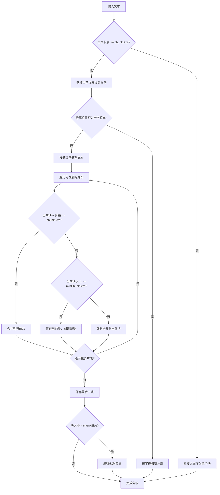
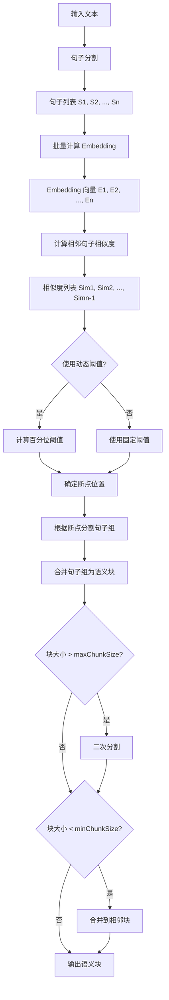
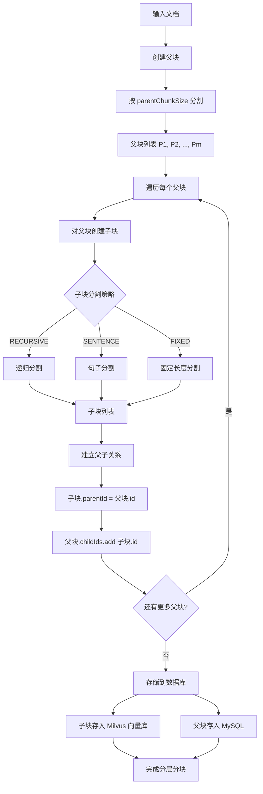
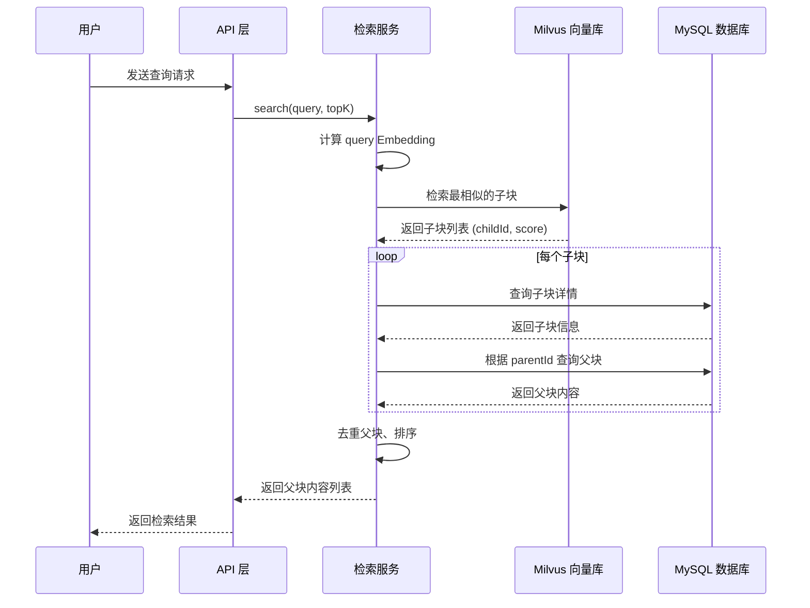

# RAG 文档分块算法设计文档

**文档版本**: v1.0
**创建日期**: 2026-03-22
**作者**: AI Engineer
**状态**: 设计阶段

---

## 1. 概述

本文档定义了 RAG 文档分块系统的三大核心分块算法设计：
- **递归分块（Recursive Chunking）**：多级分隔符递归切分
- **语义分块（Semantic Chunking）**：基于 Embedding 相似度的真正语义分割
- **分层分块（Hierarchical Chunking）**：父子分块结构，大块检索、小块生成

---

## 2. 现有架构分析

### 2.1 当前实现

| 组件 | 类名 | 功能描述 |
|------|------|---------|
| 分块策略接口 | `ChunkStrategy` | 定义统一的分块接口 |
| 固定长度分块 | `FixedLengthChunker` | 按固定字符数切分 |
| 语义分块 | `SemanticChunker` | 基于段落的简单分块（非真正语义） |
| 混合分块 | `HybridChunker` | 语义+固定长度组合 |
| 自定义规则 | `CustomRuleChunker` | 基于自定义分隔符 |

### 2.2 现有问题

1. **SemanticChunker** 仅为基于 `\n\n` 的段落分割，非真正的语义分块
2. 缺少递归分块能力，无法按优先级使用多级分隔符
3. 缺少分层分块结构，无法实现"大块检索、小块生成"

---

## 3. 递归分块算法设计

### 3.1 算法原理

递归分块按照分隔符优先级从高到低依次尝试分割文本：
1. 优先使用高优先级分隔符（如章节标题）
2. 如果分割后的块仍然超过 `chunkSize`，则使用下一级分隔符
3. 递归直到所有块都满足大小要求或达到最小分割单元

### 3.2 分隔符优先级设计

```java
/**
 * 递归分块配置
 */
@Data
public class RecursiveChunkConfig {
    /**
     * 目标块大小（字符数）
     * 默认值: 500, 范围: [100, 4000]
     */
    private int chunkSize = 500;

    /**
     * 块重叠大小（字符数）
     * 默认值: 50, 范围: [0, chunkSize/2]
     */
    private int overlap = 50;

    /**
     * 最小块大小（字符数）
     * 小于此值的块将被合并到相邻块
     * 默认值: 50, 范围: [10, chunkSize/2]
     */
    private int minChunkSize = 50;

    /**
     * 分隔符优先级列表（从高到低）
     * 默认分隔符适用于中文和英文文档
     */
    private List<String> separators = Arrays.asList(
        "\n\n\n",      // 章节分隔（最高优先级）
        "\n\n",        // 段落分隔
        "\n",          // 行分隔
        "。",          // 中文句号
        "！",          // 中文感叹号
        "？",          // 中文问号
        ".",           // 英文句号
        "!",           // 英文感叹号
        "?",           // 英文问号
        "；",          // 中文分号
        ";",           // 英文分号
        "，",          // 中文逗号
        ",",           // 英文逗号
        " ",           // 空格
        ""             // 字符级别（最低优先级）
    );

    /**
     * 是否保留分隔符
     * 默认值: true
     */
    private boolean keepSeparator = true;

    /**
     * 长度计算函数类型
     * 默认值: CHARACTER（字符数）
     */
    private LengthFunction lengthFunction = LengthFunction.CHARACTER;
}

public enum LengthFunction {
    CHARACTER,   // 按字符数计算
    TOKEN,       // 按 Token 数计算（需调用 Tokenizer）
    CUSTOM       // 自定义计算函数
}
```

### 3.3 核心算法流程



### 3.4 类设计

```java
package com.example.doc.chunker.impl;

/**
 * 递归分块器
 * 按照分隔符优先级递归分割文本
 */
@Component
public class RecursiveChunker implements ChunkStrategy {

    @Override
    public String getName() {
        return "recursive";
    }

    @Override
    public List<TextChunk> chunk(String text, ChunkConfig config) {
        RecursiveChunkConfig recursiveConfig = buildRecursiveConfig(config);
        List<TextChunk> chunks = new ArrayList<>();
        splitRecursively(text, recursiveConfig.getSeparators(), 0, chunks, recursiveConfig);
        return chunks;
    }

    /**
     * 递归分割文本
     *
     * @param text 待分割文本
     * @param separators 分隔符列表
     * @param separatorIndex 当前分隔符索引
     * @param chunks 结果块列表
     * @param config 配置
     */
    private void splitRecursively(
            String text,
            List<String> separators,
            int separatorIndex,
            List<TextChunk> chunks,
            RecursiveChunkConfig config) {
        // 实现递归分割逻辑
    }

    /**
     * 使用指定分隔符分割文本
     */
    private List<String> splitBySeparator(String text, String separator, boolean keepSeparator) {
        // 实现分割逻辑
    }

    /**
     * 合并小块
     */
    private List<String> mergeSmallChunks(List<String> splits, int minChunkSize) {
        // 实现合并逻辑
    }
}
```

---

## 4. 语义分块算法设计

### 4.1 算法原理

真正的语义分块基于句子 Embedding 相似度进行边界检测：
1. 将文本分割成句子序列
2. 为每个句子计算 Embedding 向量
3. 计算相邻句子之间的相似度
4. 当相似度低于阈值时，判定为语义边界
5. 合并连续句子形成语义块

### 4.2 配置设计

```java
/**
 * 语义分块配置
 */
@Data
public class SemanticChunkConfig {
    /**
     * 相似度阈值（余弦相似度）
     * 当相邻句子相似度低于此值时，创建新的语义块
     * 默认值: 0.45, 范围: [0.0, 1.0]
     */
    private double similarityThreshold = 0.45;

    /**
     * 相似度计算百分位阈值
     * 使用百分位数动态计算阈值时的百分位
     * 默认值: 0.8 (第80百分位), 范围: [0.5, 0.95]
     */
    private double percentileThreshold = 0.8;

    /**
     * 是否使用动态阈值
     * true: 根据文档内容动态计算阈值
     * false: 使用固定阈值
     * 默认值: true
     */
    private boolean useDynamicThreshold = true;

    /**
     * 最小块大小（字符数）
     * 默认值: 100, 范围: [50, 500]
     */
    private int minChunkSize = 100;

    /**
     * 最大块大小（字符数）
     * 默认值: 2000, 范围: [500, 8000]
     */
    private int maxChunkSize = 2000;

    /**
     * 句子分割模式
     * 支持中英文混合
     */
    private String sentenceSplitPattern = "[。！？.!?]+\\s*";

    /**
     * 相似度断点检测方法
     */
    private BreakpointMethod breakpointMethod = BreakpointMethod.PERCENTILE;
}

/**
 * 断点检测方法
 */
public enum BreakpointMethod {
    FIXED_THRESHOLD,    // 固定阈值
    PERCENTILE,         // 百分位数
    GRADIENT,           // 梯度检测
    INTERQUARTILE       // 四分位距
}
```

### 4.3 核心算法流程



### 4.4 相似度计算

```java
/**
 * 余弦相似度计算
 */
public class SimilarityCalculator {

    /**
     * 计算两个向量的余弦相似度
     * similarity = (A · B) / (||A|| * ||B||)
     */
    public static double cosineSimilarity(float[] vectorA, float[] vectorB) {
        if (vectorA.length != vectorB.length) {
            throw new IllegalArgumentException("Vectors must have same dimension");
        }

        double dotProduct = 0.0;
        double normA = 0.0;
        double normB = 0.0;

        for (int i = 0; i < vectorA.length; i++) {
            dotProduct += vectorA[i] * vectorB[i];
            normA += vectorA[i] * vectorA[i];
            normB += vectorB[i] * vectorB[i];
        }

        if (normA == 0 || normB == 0) {
            return 0.0;
        }

        return dotProduct / (Math.sqrt(normA) * Math.sqrt(normB));
    }
}
```

### 4.5 断点检测算法

```java
/**
 * 断点检测器
 */
public class BreakpointDetector {

    /**
     * 基于百分位数的断点检测
     * 找出相似度低于指定百分位的点作为断点
     */
    public List<Integer> detectByPercentile(
            List<Double> similarities,
            double percentile) {

        List<Double> sorted = new ArrayList<>(similarities);
        Collections.sort(sorted);

        // 计算百分位阈值
        int index = (int) Math.ceil(percentile * sorted.size()) - 1;
        double threshold = sorted.get(Math.max(0, index));

        // 找出低于阈值的点
        List<Integer> breakpoints = new ArrayList<>();
        for (int i = 0; i < similarities.size(); i++) {
            if (similarities.get(i) < threshold) {
                breakpoints.add(i + 1); // 断点位置是下一句的起始
            }
        }

        return breakpoints;
    }

    /**
     * 基于梯度的断点检测
     * 检测相似度急剧下降的点
     */
    public List<Integer> detectByGradient(
            List<Double> similarities,
            double gradientThreshold) {

        List<Integer> breakpoints = new ArrayList<>();

        for (int i = 1; i < similarities.size(); i++) {
            double gradient = similarities.get(i - 1) - similarities.get(i);
            if (gradient > gradientThreshold) {
                breakpoints.add(i + 1);
            }
        }

        return breakpoints;
    }
}
```

### 4.6 类设计

```java
package com.example.doc.chunker.impl;

/**
 * 真正的语义分块器
 * 基于 Embedding 相似度进行语义边界检测
 */
@Component
@RequiredArgsConstructor
public class TrueSemanticChunker implements ChunkStrategy {

    private final EmbeddingService embeddingService;

    @Override
    public String getName() {
        return "true_semantic";
    }

    @Override
    public List<TextChunk> chunk(String text, ChunkConfig config) {
        SemanticChunkConfig semanticConfig = buildSemanticConfig(config);

        // 1. 句子分割
        List<String> sentences = splitIntoSentences(text, semanticConfig);

        // 2. 批量计算 Embedding
        List<float[]> embeddings = embeddingService.embed(sentences);

        // 3. 计算相邻句子相似度
        List<Double> similarities = calculateSimilarities(embeddings);

        // 4. 检测断点
        List<Integer> breakpoints = detectBreakpoints(similarities, semanticConfig);

        // 5. 根据断点创建语义块
        return createSemanticChunks(sentences, breakpoints, semanticConfig);
    }

    /**
     * 句子分割（支持中英文混合）
     */
    private List<String> splitIntoSentences(String text, SemanticChunkConfig config) {
        List<String> sentences = new ArrayList<>();
        Pattern pattern = Pattern.compile(config.getSentenceSplitPattern());
        // 实现分割逻辑...
        return sentences;
    }

    /**
     * 计算相邻句子相似度
     */
    private List<Double> calculateSimilarities(List<float[]> embeddings) {
        List<Double> similarities = new ArrayList<>();
        for (int i = 0; i < embeddings.size() - 1; i++) {
            double sim = SimilarityCalculator.cosineSimilarity(
                embeddings.get(i), embeddings.get(i + 1));
            similarities.add(sim);
        }
        return similarities;
    }

    /**
     * 检测断点
     */
    private List<Integer> detectBreakpoints(
            List<Double> similarities,
            SemanticChunkConfig config) {
        BreakpointDetector detector = new BreakpointDetector();

        return switch (config.getBreakpointMethod()) {
            case PERCENTILE -> detector.detectByPercentile(
                similarities, config.getPercentileThreshold());
            case GRADIENT -> detector.detectByGradient(
                similarities, 0.3);
            case FIXED_THRESHOLD -> detector.detectByFixedThreshold(
                similarities, config.getSimilarityThreshold());
            default -> detector.detectByPercentile(
                similarities, config.getPercentileThreshold());
        };
    }
}
```

---

## 5. 分层分块算法设计

### 5.1 算法原理

分层分块（Hierarchical Chunking）实现"大块检索、小块生成"的 RAG 策略：
1. **父块（Parent Chunk）**：较大的文本块，用于向量检索
2. **子块（Child Chunk）**：父块的细分，用于 LLM 生成

检索流程：
1. 对查询进行 Embedding
2. 在子块向量库中检索最相关的子块
3. 通过子块找到对应的父块
4. 将父块内容返回给 LLM 进行生成

### 5.2 数据结构设计

```java
/**
 * 分层块数据结构
 */
@Data
@Builder
@NoArgsConstructor
@AllArgsConstructor
public class HierarchicalChunk {
    /**
     * 块唯一标识
     */
    private String id;

    /**
     * 块内容
     */
    private String content;

    /**
     * 块层级
     */
    private ChunkLevel level;

    /**
     * 父块 ID（子块指向父块）
     */
    private String parentId;

    /**
     * 子块 ID 列表（父块指向子块）
     */
    private List<String> childIds;

    /**
     * 文档名称
     */
    private String documentName;

    /**
     * 在文档中的起始位置
     */
    private int startPosition;

    /**
     * 在文档中的结束位置
     */
    private int endPosition;

    /**
     * 块索引（同层级内的序号）
     */
    private int index;

    /**
     * 元数据
     */
    private Map<String, Object> metadata;
}

/**
 * 块层级枚举
 */
public enum ChunkLevel {
    PARENT,   // 父块
    CHILD     // 子块
}
```

### 5.3 配置设计

```java
/**
 * 分层分块配置
 */
@Data
public class HierarchicalChunkConfig {
    /**
     * 父块大小（字符数）
     * 默认值: 2000, 范围: [1000, 8000]
     */
    private int parentChunkSize = 2000;

    /**
     * 父块重叠大小（字符数）
     * 默认值: 200, 范围: [0, parentChunkSize/4]
     */
    private int parentOverlap = 200;

    /**
     * 子块大小（字符数）
     * 默认值: 200, 范围: [100, 1000]
     */
    private int childChunkSize = 200;

    /**
     * 子块重叠大小（字符数）
     * 默认值: 20, 范围: [0, childChunkSize/4]
     */
    private int childOverlap = 20;

    /**
     * 子块分割策略
     * RECURSIVE: 递归分割
     * SENTENCE: 按句子分割
     * 默认值: RECURSIVE
     */
    private ChildSplitStrategy childSplitStrategy = ChildSplitStrategy.RECURSIVE;

    /**
     * 是否为父块生成 Embedding
     * true: 父块和子块都有 Embedding
     * false: 只有子块有 Embedding
     * 默认值: false
     */
    private boolean embedParent = false;
}

public enum ChildSplitStrategy {
    RECURSIVE,   // 递归分割
    SENTENCE,    // 按句子分割
    FIXED        // 固定长度分割
}
```

### 5.4 核心算法流程



### 5.5 检索流程



### 5.6 类设计

```java
package com.example.doc.chunker.impl;

/**
 * 分层分块器
 * 实现父子块结构的分块策略
 */
@Component
@RequiredArgsConstructor
public class HierarchicalChunker implements ChunkStrategy {

    private final RecursiveChunker recursiveChunker;

    @Override
    public String getName() {
        return "hierarchical";
    }

    @Override
    public List<TextChunk> chunk(String text, ChunkConfig config) {
        // 分层分块返回特殊的 HierarchicalChunk 结构
        // 这里为兼容接口，返回扁平化的块列表
        List<HierarchicalChunk> hierarchicalChunks = chunkHierarchical(text, config);
        return flattenChunks(hierarchicalChunks);
    }

    /**
     * 执行分层分块
     */
    public HierarchicalChunkResult chunkHierarchical(String text, ChunkConfig baseConfig) {
        HierarchicalChunkConfig config = buildHierarchicalConfig(baseConfig);
        HierarchicalChunkResult result = new HierarchicalChunkResult();

        // 1. 创建父块
        List<HierarchicalChunk> parentChunks = createParentChunks(text, config);
        result.setParentChunks(parentChunks);

        // 2. 为每个父块创建子块
        for (HierarchicalChunk parent : parentChunks) {
            List<HierarchicalChunk> children = createChildChunks(parent, config);
            parent.setChildIds(children.stream()
                .map(HierarchicalChunk::getId)
                .collect(Collectors.toList()));

            children.forEach(c -> c.setParentId(parent.getId()));
            result.addChildChunks(children);
        }

        return result;
    }

    /**
     * 创建父块
     */
    private List<HierarchicalChunk> createParentChunks(
            String text,
            HierarchicalChunkConfig config) {

        List<HierarchicalChunk> parents = new ArrayList<>();
        int position = 0;
        int index = 0;

        while (position < text.length()) {
            int end = Math.min(position + config.getParentChunkSize(), text.length());
            String content = text.substring(position, end);

            HierarchicalChunk parent = HierarchicalChunk.builder()
                .id(UUID.randomUUID().toString())
                .content(content)
                .level(ChunkLevel.PARENT)
                .startPosition(position)
                .endPosition(end)
                .index(index++)
                .childIds(new ArrayList<>())
                .build();

            parents.add(parent);
            position = end - config.getParentOverlap();
        }

        return parents;
    }

    /**
     * 为父块创建子块
     */
    private List<HierarchicalChunk> createChildChunks(
            HierarchicalChunk parent,
            HierarchicalChunkConfig config) {

        List<HierarchicalChunk> children = new ArrayList<>();

        // 根据配置选择分割策略
        List<String> splits = switch (config.getChildSplitStrategy()) {
            case RECURSIVE -> splitRecursively(parent.getContent(), config);
            case SENTENCE -> splitBySentence(parent.getContent(), config);
            case FIXED -> splitFixed(parent.getContent(), config);
        };

        int position = parent.getStartPosition();
        int index = 0;

        for (String split : splits) {
            HierarchicalChunk child = HierarchicalChunk.builder()
                .id(UUID.randomUUID().toString())
                .content(split)
                .level(ChunkLevel.CHILD)
                .parentId(parent.getId())
                .startPosition(position)
                .endPosition(position + split.length())
                .index(index++)
                .build();

            children.add(child);
            position += split.length();
        }

        return children;
    }
}

/**
 * 分层分块结果
 */
@Data
public class HierarchicalChunkResult {
    private List<HierarchicalChunk> parentChunks = new ArrayList<>();
    private List<HierarchicalChunk> childChunks = new ArrayList<>();
}
```

### 5.7 数据库实体设计

```java
/**
 * 父块实体（存储在 MySQL）
 */
@Entity
@Table(name = "parent_chunks")
@Data
@Builder
@NoArgsConstructor
@AllArgsConstructor
public class ParentChunk {

    @Id
    private String id;

    @Column(columnDefinition = "TEXT")
    private String content;

    @Column(name = "document_name")
    private String documentName;

    @Column(name = "chunk_size")
    private Integer chunkSize;

    @Column(name = "chunk_index")
    private Integer chunkIndex;

    @Column(name = "child_count")
    private Integer childCount;

    @Column(name = "start_position")
    private Integer startPosition;

    @Column(name = "end_position")
    private Integer endPosition;

    @CreationTimestamp
    @Column(name = "created_at", updatable = false)
    private LocalDateTime createdAt;

    @UpdateTimestamp
    @Column(name = "updated_at")
    private LocalDateTime updatedAt;
}

/**
 * 子块实体（存储在 MySQL + Milvus）
 */
@Entity
@Table(name = "child_chunks")
@Data
@Builder
@NoArgsConstructor
@AllArgsConstructor
public class ChildChunk {

    @Id
    private String id;

    @Column(name = "parent_id")
    private String parentId;

    @Column(columnDefinition = "TEXT")
    private String content;

    @Column(name = "document_name")
    private String documentName;

    @Column(name = "chunk_size")
    private Integer chunkSize;

    @Column(name = "chunk_index")
    private Integer chunkIndex;

    @Column(name = "start_position")
    private Integer startPosition;

    @Column(name = "end_position")
    private Integer endPosition;

    @Column(name = "vector_indexed")
    private Boolean vectorIndexed = false;

    @CreationTimestamp
    @Column(name = "created_at", updatable = false)
    private LocalDateTime createdAt;
}
```

---

## 6. 策略枚举扩展

```java
/**
 * 分块策略枚举（扩展）
 */
public enum ChunkStrategyType {
    FIXED_LENGTH("fixed_length", "固定长度分块"),
    RECURSIVE("recursive", "递归分块"),
    SEMANTIC("semantic", "简单语义分块（基于段落）"),
    TRUE_SEMANTIC("true_semantic", "真正的语义分块（基于 Embedding）"),
    HIERARCHICAL("hierarchical", "分层分块（父子结构）"),
    HYBRID("hybrid", "混合分块"),
    CUSTOM_RULE("custom_rule", "自定义规则分块");

    private final String code;
    private final String description;

    // constructor, getters...
}
```

---

## 7. 参数配置汇总

| 策略 | 参数名 | 默认值 | 范围 | 说明 |
|------|--------|--------|------|------|
| **递归分块** | chunkSize | 500 | [100, 4000] | 目标块大小 |
| | overlap | 50 | [0, chunkSize/2] | 块重叠大小 |
| | minChunkSize | 50 | [10, chunkSize/2] | 最小块大小 |
| | keepSeparator | true | - | 是否保留分隔符 |
| **语义分块** | similarityThreshold | 0.45 | [0.0, 1.0] | 相似度阈值 |
| | percentileThreshold | 0.8 | [0.5, 0.95] | 百分位阈值 |
| | minChunkSize | 100 | [50, 500] | 最小块大小 |
| | maxChunkSize | 2000 | [500, 8000] | 最大块大小 |
| **分层分块** | parentChunkSize | 2000 | [1000, 8000] | 父块大小 |
| | childChunkSize | 200 | [100, 1000] | 子块大小 |
| | parentOverlap | 200 | [0, parent/4] | 父块重叠 |
| | childOverlap | 20 | [0, child/4] | 子块重叠 |

---

## 8. 性能考量

### 8.1 语义分块性能优化

```java
/**
 * 批量 Embedding 计算优化
 */
@Service
public class BatchEmbeddingService {

    /**
     * 批量大小
     * 避免单次请求过大
     */
    private static final int BATCH_SIZE = 20;

    /**
     * 批量计算 Embedding（带缓存）
     */
    public List<float[]> batchEmbed(List<String> texts) {
        List<float[]> results = new ArrayList<>();

        // 分批处理
        for (int i = 0; i < texts.size(); i += BATCH_SIZE) {
            int end = Math.min(i + BATCH_SIZE, texts.size());
            List<String> batch = texts.subList(i, end);
            List<float[]> batchResults = embeddingService.embed(batch);
            results.addAll(batchResults);
        }

        return results;
    }
}
```

### 8.2 分层分块存储优化

- 父块存储在 MySQL，不需要向量索引
- 子块存储在 Milvus，需要向量索引用于检索
- 通过 `parentId` 建立父子关系映射

---

## 9. 参考资料

1. [LangChain RecursiveCharacterTextSplitter](https://python.langchain.com/docs/modules/data_connection/document_transformers/recursive_text_splitter)
2. [Semantic Chunking with Embeddings](https://www.pinecone.io/learn/chunking-strategies/)
3. [Parent Document Retriever](https://python.langchain.com/docs/modules/data_connection/retrievers/parent_document_retriever)
4. [Late Chunking: Contextual Chunk Embeddings](https://arxiv.org/pdf/2409.04701)
