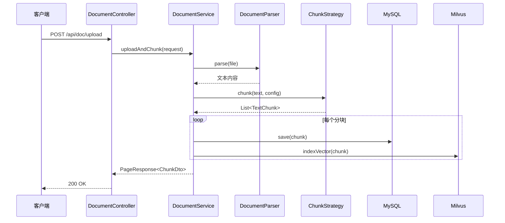
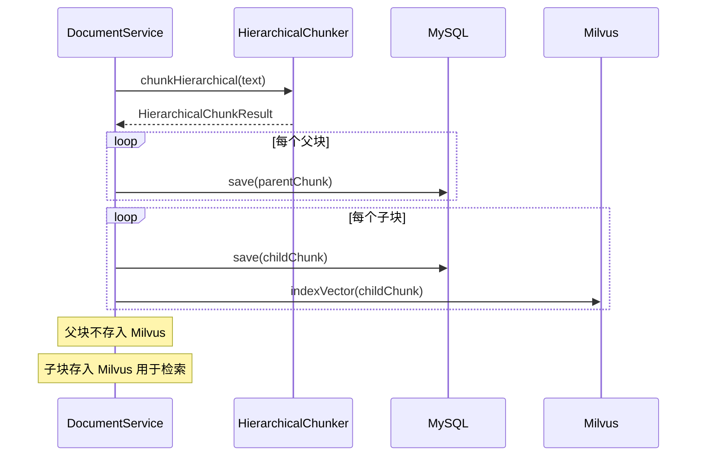
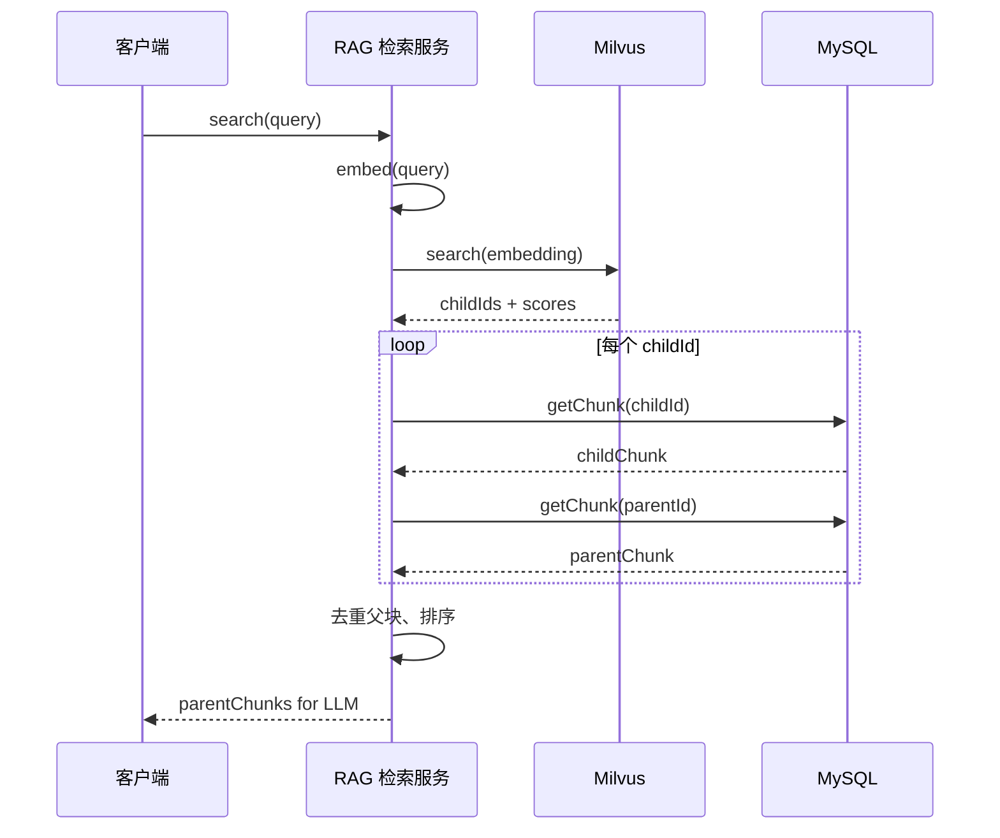

# RAG 文档分块系统 API 接口设计文档

**文档版本**: v1.0
**创建日期**: 2026-03-22
**作者**: AI Engineer
**状态**: 设计阶段

---

## 1. 概述

本文档定义了 RAG 文档分块系统的 API 接口设计，支持以下功能：
- 文档上传与分块（支持新的分块策略）
- 分块预览（上传前预览分块效果）
- 分块结果查询（支持分层展示）
- 分块配置管理

---

## 2. API 端点总览

| 端点 | 方法 | 描述 |
|------|------|------|
| `/api/doc/upload` | POST | 上传文档并执行分块 |
| `/api/doc/preview` | POST | 预览分块结果（不保存） |
| `/api/doc/chunks` | GET | 查询分块列表（分页） |
| `/api/doc/chunks/{id}` | GET | 查询单个分块详情 |
| `/api/doc/chunks/{id}/children` | GET | 查询子块列表（分层结构） |
| `/api/doc/chunks/{id}/parent` | GET | 查询父块（分层结构） |
| `/api/doc/chunks/{id}` | PUT | 更新分块内容 |
| `/api/doc/chunks/{id}` | DELETE | 删除单个分块 |
| `/api/doc/chunks/batch` | DELETE | 批量删除分块 |
| `/api/doc/documents` | GET | 获取文档列表 |
| `/api/doc/documents/{name}` | DELETE | 删除文档及其所有分块 |
| `/api/doc/config/defaults` | GET | 获取各策略默认配置 |

---

## 3. 请求/响应 DTO 定义

### 3.1 基础 DTO

```java
package com.example.doc.dto;

/**
 * 分块策略枚举
 */
public enum ChunkStrategyType {
    FIXED_LENGTH("fixed_length", "固定长度分块"),
    RECURSIVE("recursive", "递归分块"),
    SEMANTIC("semantic", "简单语义分块"),
    TRUE_SEMANTIC("true_semantic", "真正语义分块"),
    HIERARCHICAL("hierarchical", "分层分块"),
    HYBRID("hybrid", "混合分块"),
    CUSTOM_RULE("custom_rule", "自定义规则分块");

    private final String code;
    private final String description;

    ChunkStrategyType(String code, String description) {
        this.code = code;
        this.description = description;
    }

    // getters...
}
```

### 3.2 上传请求 DTO

```java
package com.example.doc.dto;

/**
 * 文档上传请求
 */
@Data
public class UploadRequest {

    /**
     * 上传的文件
     */
    private MultipartFile file;

    // ==================== 基础配置 ====================

    /**
     * 分块策略
     * 必填，可选值见 ChunkStrategyType
     */
    @NotBlank(message = "分块策略不能为空")
    private String strategy;

    /**
     * 标签列表
     */
    private List<String> tags;

    // ==================== 递归分块配置 ====================

    /**
     * 目标块大小（字符数）
     * 默认: 500, 范围: [100, 4000]
     */
    @Min(value = 100, message = "chunkSize 最小为 100")
    @Max(value = 4000, message = "chunkSize 最大为 4000")
    private Integer chunkSize;

    /**
     * 块重叠大小（字符数）
     * 默认: 50, 范围: [0, chunkSize/2]
     */
    @Min(value = 0, message = "overlap 不能为负数")
    private Integer overlap;

    /**
     * 最小块大小
     * 默认: 50
     */
    @Min(value = 10, message = "minChunkSize 最小为 10")
    private Integer minChunkSize;

    /**
     * 是否保留分隔符
     * 默认: true
     */
    private Boolean keepSeparator;

    /**
     * 自定义分隔符列表（优先级从高到低）
     * 为空时使用默认分隔符
     */
    private List<String> separators;

    // ==================== 语义分块配置 ====================

    /**
     * 相似度阈值（余弦相似度）
     * 默认: 0.45, 范围: [0.0, 1.0]
     */
    @DecimalMin(value = "0.0", message = "similarityThreshold 最小为 0.0")
    @DecimalMax(value = "1.0", message = "similarityThreshold 最大为 1.0")
    private Double similarityThreshold;

    /**
     * 百分位阈值
     * 默认: 0.8, 范围: [0.5, 0.95]
     */
    @DecimalMin(value = "0.5", message = "percentileThreshold 最小为 0.5")
    @DecimalMax(value = "0.95", message = "percentileThreshold 最大为 0.95")
    private Double percentileThreshold;

    /**
     * 是否使用动态阈值
     * 默认: true
     */
    private Boolean useDynamicThreshold;

    /**
     * 断点检测方法
     * 可选值: PERCENTILE, GRADIENT, FIXED_THRESHOLD, INTERQUARTILE
     */
    private String breakpointMethod;

    // ==================== 分层分块配置 ====================

    /**
     * 父块大小
     * 默认: 2000, 范围: [1000, 8000]
     */
    @Min(value = 1000, message = "parentChunkSize 最小为 1000")
    @Max(value = 8000, message = "parentChunkSize 最大为 8000")
    private Integer parentChunkSize;

    /**
     * 父块重叠大小
     * 默认: 200
     */
    private Integer parentOverlap;

    /**
     * 子块大小
     * 默认: 200, 范围: [100, 1000]
     */
    @Min(value = 100, message = "childChunkSize 最小为 100")
    @Max(value = 1000, message = "childChunkSize 最大为 1000")
    private Integer childChunkSize;

    /**
     * 子块重叠大小
     * 默认: 20
     */
    private Integer childOverlap;

    /**
     * 子块分割策略
     * 可选值: RECURSIVE, SENTENCE, FIXED
     */
    private String childSplitStrategy;

    /**
     * 是否为父块生成 Embedding
     * 默认: false
     */
    private Boolean embedParent;

    // ==================== 兼容旧配置 ====================

    private Boolean keepHeaders;
    private Integer minParagraphLength;
    private String[] delimiters;
    private Integer[] headerLevels;
}
```

### 3.3 分块预览请求 DTO

```java
package com.example.doc.dto;

/**
 * 分块预览请求（不上传文件，直接传入文本）
 */
@Data
public class ChunkPreviewRequest {

    /**
     * 待预览的文本内容
     */
    @NotBlank(message = "文本内容不能为空")
    private String text;

    /**
     * 分块策略
     */
    @NotBlank(message = "分块策略不能为空")
    private String strategy;

    // 所有 UploadRequest 中的配置参数都支持
    private Integer chunkSize;
    private Integer overlap;
    private Integer minChunkSize;
    private Boolean keepSeparator;
    private List<String> separators;
    private Double similarityThreshold;
    private Double percentileThreshold;
    private Boolean useDynamicThreshold;
    private String breakpointMethod;
    private Integer parentChunkSize;
    private Integer parentOverlap;
    private Integer childChunkSize;
    private Integer childOverlap;
    private String childSplitStrategy;
    private Boolean embedParent;
}
```

### 3.4 分块响应 DTO

```java
package com.example.doc.dto;

/**
 * 分块响应 DTO
 */
@Data
@Builder
@NoArgsConstructor
@AllArgsConstructor
public class ChunkDto {

    /**
     * 分块唯一标识
     */
    private String id;

    /**
     * 分块内容
     */
    private String content;

    /**
     * 文档名称
     */
    private String documentName;

    /**
     * 分块大小（字符数）
     */
    private Integer chunkSize;

    /**
     * 分块索引（同文档内的序号）
     */
    private Integer chunkIndex;

    /**
     * 分块策略
     */
    private String strategy;

    /**
     * 标签列表
     */
    private List<String> tags;

    /**
     * 块层级（仅分层分块有效）
     * PARENT: 父块
     * CHILD: 子块
     */
    private String level;

    /**
     * 父块 ID（仅子块有效）
     */
    private String parentId;

    /**
     * 子块数量（仅父块有效）
     */
    private Integer childCount;

    /**
     * 子块 ID 列表（仅父块有效）
     */
    private List<String> childIds;

    /**
     * 在文档中的起始位置
     */
    private Integer startPosition;

    /**
     * 在文档中的结束位置
     */
    private Integer endPosition;

    /**
     * 向量是否已索引
     */
    private Boolean vectorIndexed;

    /**
     * 创建时间
     */
    private LocalDateTime createdAt;

    /**
     * 更新时间
     */
    private LocalDateTime updatedAt;
}

/**
 * 分块预览响应（包含预览信息）
 */
@Data
@Builder
@NoArgsConstructor
@AllArgsConstructor
public class ChunkPreviewDto {

    /**
     * 预览 ID（临时标识，非持久化）
     */
    private String previewId;

    /**
     * 原文长度
     */
    private Integer originalLength;

    /**
     * 分块数量
     */
    private Integer totalChunks;

    /**
     * 使用的策略
     */
    private String strategy;

    /**
     * 使用的配置参数
     */
    private Map<String, Object> appliedConfig;

    /**
     * 分块结果列表
     */
    private List<ChunkDto> chunks;

    /**
     * 统计信息
     */
    private ChunkStatistics statistics;

    /**
     * 预览生成时间
     */
    private LocalDateTime previewedAt;
}

/**
 * 分块统计信息
 */
@Data
@Builder
@NoArgsConstructor
@AllArgsConstructor
public class ChunkStatistics {

    /**
     * 总块数
     */
    private Integer totalCount;

    /**
     * 平均块大小
     */
    private Double avgChunkSize;

    /**
     * 最小块大小
     */
    private Integer minChunkSize;

    /**
     * 最大块大小
     */
    private Integer maxChunkSize;

    /**
     * 父块数量（分层分块）
     */
    private Integer parentCount;

    /**
     * 子块数量（分层分块）
     */
    private Integer childCount;
}
```

### 3.5 分页响应 DTO

```java
package com.example.doc.dto;

/**
 * 分页查询请求
 */
@Data
public class ChunkQueryRequest {

    /**
     * 页码（从 0 开始）
     */
    @Min(value = 0, message = "页码不能为负数")
    private Integer page = 0;

    /**
     * 每页大小
     */
    @Min(value = 1, message = "每页大小最小为 1")
    @Max(value = 100, message = "每页大小最大为 100")
    private Integer size = 10;

    /**
     * 关键词搜索（匹配文档名）
     */
    private String keyword;

    /**
     * 文档名称（精确匹配）
     */
    private String documentName;

    /**
     * 分块策略过滤
     */
    private String strategy;

    /**
     * 块层级过滤（PARENT/CHILD）
     */
    private String level;

    /**
     * 是否包含子块（查询父块时是否同时返回子块）
     */
    private Boolean includeChildren = false;

    /**
     * 排序字段
     */
    private String sortBy = "createdAt";

    /**
     * 排序方向
     */
    private String sortDirection = "DESC";
}

/**
 * 分页响应
 */
@Data
@Builder
@NoArgsConstructor
@AllArgsConstructor
public class PageResponse<T> {

    /**
     * 数据列表
     */
    private List<T> content;

    /**
     * 总记录数
     */
    private Long totalElements;

    /**
     * 总页数
     */
    private Integer totalPages;

    /**
     * 当前页码
     */
    private Integer pageNumber;

    /**
     * 每页大小
     */
    private Integer pageSize;

    /**
     * 是否第一页
     */
    private Boolean first;

    /**
     * 是否最后一页
     */
    private Boolean last;
}
```

### 3.6 配置响应 DTO

```java
package com.example.doc.dto;

/**
 * 策略默认配置响应
 */
@Data
@Builder
@NoArgsConstructor
@AllArgsConstructor
public class StrategyConfigDto {

    /**
     * 策略名称
     */
    private String strategy;

    /**
     * 策略描述
     */
    private String description;

    /**
     * 默认配置参数
     */
    private Map<String, ConfigParamDto> defaultConfig;

    /**
     * 是否需要 Embedding 服务
     */
    private Boolean requiresEmbedding;
}

/**
 * 配置参数描述
 */
@Data
@Builder
@NoArgsConstructor
@AllArgsConstructor
public class ConfigParamDto {

    /**
     * 参数名
     */
    private String name;

    /**
     * 参数描述
     */
    private String description;

    /**
     * 默认值
     */
    private Object defaultValue;

    /**
     * 数据类型
     */
    private String type;

    /**
     * 最小值（数值类型）
     */
    private Object minValue;

    /**
     * 最大值（数值类型）
     */
    private Object maxValue;

    /**
     * 可选值（枚举类型）
     */
    private List<String> options;
}

/**
 * 所有策略配置响应
 */
@Data
@Builder
@NoArgsConstructor
@AllArgsConstructor
public class AllStrategiesConfigDto {

    /**
     * 所有策略配置列表
     */
    private List<StrategyConfigDto> strategies;

    /**
     * 服务版本
     */
    private String version;
}
```

### 3.7 错误响应 DTO

```java
package com.example.doc.dto;

/**
 * 统一错误响应
 */
@Data
@Builder
@NoArgsConstructor
@AllArgsConstructor
public class ErrorResponse {

    /**
     * 错误码
     */
    private String code;

    /**
     * 错误消息
     */
    private String message;

    /**
     * 详细错误信息
     */
    private String detail;

    /**
     * 时间戳
     */
    private LocalDateTime timestamp;

    /**
     * 请求路径
     */
    private String path;

    /**
     * 预定义错误码
     */
    public static final String INVALID_STRATEGY = "CHUNK_001";
    public static final String FILE_PARSE_ERROR = "CHUNK_002";
    public static final String CHUNK_NOT_FOUND = "CHUNK_003";
    public static final String INVALID_CONFIG = "CHUNK_004";
    public static final String EMBEDDING_ERROR = "CHUNK_005";
    public static final String VECTOR_INDEX_ERROR = "CHUNK_006";
}
```

---

## 4. API 接口详细设计

### 4.1 上传文档并分块

```
POST /api/doc/upload
Content-Type: multipart/form-data
```

**请求参数**:

| 参数名 | 类型 | 必填 | 描述 |
|--------|------|------|------|
| file | MultipartFile | 是 | 上传的文件 |
| strategy | String | 是 | 分块策略 |
| chunkSize | Integer | 否 | 块大小 |
| overlap | Integer | 否 | 重叠大小 |
| ... | ... | ... | 其他配置参数见 UploadRequest |

**请求示例**:

```bash
curl -X POST "http://localhost:8080/api/doc/upload" \
  -H "Content-Type: multipart/form-data" \
  -F "file=@document.pdf" \
  -F "strategy=recursive" \
  -F "chunkSize=500" \
  -F "overlap=50" \
  -F "tags=技术文档,API设计"
```

**响应示例**:

```json
{
  "content": [
    {
      "id": "550e8400-e29b-41d4-a716-446655440001",
      "content": "第一章 系统概述\n\n本文档描述了...",
      "documentName": "document.pdf",
      "chunkSize": 487,
      "chunkIndex": 0,
      "strategy": "recursive",
      "tags": ["技术文档", "API设计"],
      "level": null,
      "parentId": null,
      "childCount": null,
      "childIds": null,
      "startPosition": 0,
      "endPosition": 487,
      "vectorIndexed": true,
      "createdAt": "2026-03-22T10:30:00",
      "updatedAt": "2026-03-22T10:30:00"
    }
  ],
  "totalElements": 15,
  "totalPages": 1,
  "pageNumber": 0,
  "pageSize": 15,
  "first": true,
  "last": true
}
```

### 4.2 分块预览

```
POST /api/doc/preview
Content-Type: application/json
```

**请求示例**:

```json
{
  "text": "第一章 系统概述\n\n本文档描述了 RAG 系统的架构设计...\n\n第二章 核心组件\n\n系统包含以下核心组件...",
  "strategy": "true_semantic",
  "similarityThreshold": 0.5,
  "minChunkSize": 100,
  "maxChunkSize": 2000
}
```

**响应示例**:

```json
{
  "previewId": "preview_550e8400",
  "originalLength": 5000,
  "totalChunks": 8,
  "strategy": "true_semantic",
  "appliedConfig": {
    "similarityThreshold": 0.5,
    "minChunkSize": 100,
    "maxChunkSize": 2000,
    "breakpointMethod": "PERCENTILE"
  },
  "chunks": [
    {
      "id": "temp_001",
      "content": "第一章 系统概述\n\n本文档描述了 RAG 系统的架构设计...",
      "chunkSize": 456,
      "chunkIndex": 0,
      "strategy": "true_semantic"
    }
  ],
  "statistics": {
    "totalCount": 8,
    "avgChunkSize": 625.0,
    "minChunkSize": 120,
    "maxChunkSize": 980,
    "parentCount": null,
    "childCount": null
  },
  "previewedAt": "2026-03-22T10:35:00"
}
```

### 4.3 查询分块列表

```
GET /api/doc/chunks
```

**请求参数**:

| 参数名 | 类型 | 必填 | 默认值 | 描述 |
|--------|------|------|--------|------|
| page | Integer | 否 | 0 | 页码 |
| size | Integer | 否 | 10 | 每页大小 |
| keyword | String | 否 | - | 关键词搜索 |
| documentName | String | 否 | - | 文档名称 |
| strategy | String | 否 | - | 策略过滤 |
| level | String | 否 | - | 层级过滤 |
| includeChildren | Boolean | 否 | false | 是否包含子块 |
| sortBy | String | 否 | createdAt | 排序字段 |
| sortDirection | String | 否 | DESC | 排序方向 |

**请求示例**:

```bash
curl -X GET "http://localhost:8080/api/doc/chunks?page=0&size=10&strategy=hierarchical&level=PARENT&includeChildren=true"
```

**响应示例**:

```json
{
  "content": [
    {
      "id": "550e8400-e29b-41d4-a716-446655440001",
      "content": "第一章 系统概述...",
      "documentName": "document.pdf",
      "chunkSize": 2000,
      "chunkIndex": 0,
      "strategy": "hierarchical",
      "level": "PARENT",
      "parentId": null,
      "childCount": 10,
      "childIds": [
        "550e8400-e29b-41d4-a716-446655440101",
        "550e8400-e29b-41d4-a716-446655440102"
      ],
      "startPosition": 0,
      "endPosition": 2000,
      "vectorIndexed": false,
      "createdAt": "2026-03-22T10:30:00",
      "updatedAt": "2026-03-22T10:30:00"
    }
  ],
  "totalElements": 50,
  "totalPages": 5,
  "pageNumber": 0,
  "pageSize": 10,
  "first": true,
  "last": false
}
```

### 4.4 查询单个分块详情

```
GET /api/doc/chunks/{id}
```

**请求示例**:

```bash
curl -X GET "http://localhost:8080/api/doc/chunks/550e8400-e29b-41d4-a716-446655440001"
```

**响应示例**: 同 ChunkDto 结构

### 4.5 查询子块列表（分层结构）

```
GET /api/doc/chunks/{parentId}/children
```

**请求参数**:

| 参数名 | 类型 | 必填 | 默认值 | 描述 |
|--------|------|------|--------|------|
| page | Integer | 否 | 0 | 页码 |
| size | Integer | 否 | 20 | 每页大小 |

**请求示例**:

```bash
curl -X GET "http://localhost:8080/api/doc/chunks/550e8400-e29b-41d4-a716-446655440001/children?page=0&size=20"
```

**响应示例**:

```json
{
  "content": [
    {
      "id": "550e8400-e29b-41d4-a716-446655440101",
      "content": "本文档描述了...",
      "documentName": "document.pdf",
      "chunkSize": 200,
      "chunkIndex": 0,
      "strategy": "hierarchical",
      "level": "CHILD",
      "parentId": "550e8400-e29b-41d4-a716-446655440001",
      "startPosition": 0,
      "endPosition": 200,
      "vectorIndexed": true,
      "createdAt": "2026-03-22T10:30:00"
    }
  ],
  "totalElements": 10,
  "totalPages": 1,
  "pageNumber": 0,
  "pageSize": 20,
  "first": true,
  "last": true
}
```

### 4.6 查询父块（分层结构）

```
GET /api/doc/chunks/{childId}/parent
```

**请求示例**:

```bash
curl -X GET "http://localhost:8080/api/doc/chunks/550e8400-e29b-41d4-a716-446655440101/parent"
```

**响应示例**: 返回父块的 ChunkDto

### 4.7 更新分块

```
PUT /api/doc/chunks/{id}
Content-Type: application/json
```

**请求示例**:

```json
{
  "content": "更新后的分块内容...",
  "tags": ["已更新", "人工审核"]
}
```

**响应示例**: 返回更新后的 ChunkDto

### 4.8 删除分块

```
DELETE /api/doc/chunks/{id}
```

**请求示例**:

```bash
curl -X DELETE "http://localhost:8080/api/doc/chunks/550e8400-e29b-41d4-a716-446655440001"
```

**响应**: HTTP 204 No Content

### 4.9 批量删除分块

```
DELETE /api/doc/chunks/batch
Content-Type: application/json
```

**请求示例**:

```json
["550e8400-e29b-41d4-a716-446655440001", "550e8400-e29b-41d4-a716-446655440002"]
```

**响应**: HTTP 204 No Content

### 4.10 获取文档列表

```
GET /api/doc/documents
```

**响应示例**:

```json
[
  "document.pdf",
  "report.docx",
  "data.xlsx"
]
```

### 4.11 删除文档及所有分块

```
DELETE /api/doc/documents/{name}
```

**请求示例**:

```bash
curl -X DELETE "http://localhost:8080/api/doc/documents/document.pdf"
```

**响应示例**:

```json
{
  "deletedChunks": 15,
  "message": "成功删除文档 'document.pdf' 及其所有分块"
}
```

### 4.12 获取策略默认配置

```
GET /api/doc/config/defaults
```

**响应示例**:

```json
{
  "strategies": [
    {
      "strategy": "recursive",
      "description": "递归分块 - 按分隔符优先级递归分割",
      "defaultConfig": {
        "chunkSize": {
          "name": "chunkSize",
          "description": "目标块大小（字符数）",
          "defaultValue": 500,
          "type": "Integer",
          "minValue": 100,
          "maxValue": 4000
        },
        "overlap": {
          "name": "overlap",
          "description": "块重叠大小（字符数）",
          "defaultValue": 50,
          "type": "Integer",
          "minValue": 0,
          "maxValue": null
        }
      },
      "requiresEmbedding": false
    },
    {
      "strategy": "true_semantic",
      "description": "真正语义分块 - 基于 Embedding 相似度",
      "defaultConfig": {
        "similarityThreshold": {
          "name": "similarityThreshold",
          "description": "相似度阈值",
          "defaultValue": 0.45,
          "type": "Double",
          "minValue": 0.0,
          "maxValue": 1.0
        },
        "percentileThreshold": {
          "name": "percentileThreshold",
          "description": "百分位阈值",
          "defaultValue": 0.8,
          "type": "Double",
          "minValue": 0.5,
          "maxValue": 0.95
        }
      },
      "requiresEmbedding": true
    },
    {
      "strategy": "hierarchical",
      "description": "分层分块 - 父子结构",
      "defaultConfig": {
        "parentChunkSize": {
          "name": "parentChunkSize",
          "description": "父块大小（字符数）",
          "defaultValue": 2000,
          "type": "Integer",
          "minValue": 1000,
          "maxValue": 8000
        },
        "childChunkSize": {
          "name": "childChunkSize",
          "description": "子块大小（字符数）",
          "defaultValue": 200,
          "type": "Integer",
          "minValue": 100,
          "maxValue": 1000
        }
      },
      "requiresEmbedding": true
    }
  ],
  "version": "2.0.0"
}
```

---

## 5. Controller 实现设计

```java
package com.example.doc.controller;

/**
 * 文档分块控制器（升级版）
 */
@RestController
@RequestMapping("/api/doc")
@RequiredArgsConstructor
@CrossOrigin(origins = "*")
@Tag(name = "文档分块 API", description = "文档上传、分块、预览、查询接口")
public class DocumentController {

    private final DocumentService documentService;
    private final ChunkPreviewService previewService;
    private final ChunkConfigService configService;

    // ==================== 上传接口 ====================

    @PostMapping(value = "/upload", consumes = MediaType.MULTIPART_FORM_DATA_VALUE)
    @Operation(summary = "上传文档并分块", description = "支持多种分块策略")
    @ApiResponses({
        @ApiResponse(responseCode = "200", description = "分块成功"),
        @ApiResponse(responseCode = "400", description = "参数错误"),
        @ApiResponse(responseCode = "500", description = "服务器错误")
    })
    public ResponseEntity<PageResponse<ChunkDto>> upload(
            @Valid @ModelAttribute UploadRequest request) {
        PageResponse<ChunkDto> result = documentService.uploadAndChunk(request);
        return ResponseEntity.ok(result);
    }

    // ==================== 预览接口 ====================

    @PostMapping("/preview")
    @Operation(summary = "预览分块结果", description = "不保存，仅返回预览结果")
    public ResponseEntity<ChunkPreviewDto> preview(
            @Valid @RequestBody ChunkPreviewRequest request) {
        ChunkPreviewDto preview = previewService.preview(request);
        return ResponseEntity.ok(preview);
    }

    // ==================== 查询接口 ====================

    @GetMapping("/chunks")
    @Operation(summary = "查询分块列表", description = "支持分页和过滤")
    public ResponseEntity<PageResponse<ChunkDto>> getChunks(
            @Valid ChunkQueryRequest request) {
        PageResponse<ChunkDto> result = documentService.getChunks(request);
        return ResponseEntity.ok(result);
    }

    @GetMapping("/chunks/{id}")
    @Operation(summary = "查询单个分块")
    public ResponseEntity<ChunkDto> getChunk(@PathVariable String id) {
        ChunkDto chunk = documentService.getChunk(id);
        return ResponseEntity.ok(chunk);
    }

    @GetMapping("/chunks/{parentId}/children")
    @Operation(summary = "查询子块列表", description = "仅对分层分块有效")
    public ResponseEntity<PageResponse<ChunkDto>> getChildren(
            @PathVariable String parentId,
            @RequestParam(defaultValue = "0") int page,
            @RequestParam(defaultValue = "20") int size) {
        PageResponse<ChunkDto> children = documentService.getChildChunks(parentId, page, size);
        return ResponseEntity.ok(children);
    }

    @GetMapping("/chunks/{childId}/parent")
    @Operation(summary = "查询父块", description = "仅对分层分块的子块有效")
    public ResponseEntity<ChunkDto> getParent(@PathVariable String childId) {
        ChunkDto parent = documentService.getParentChunk(childId);
        return ResponseEntity.ok(parent);
    }

    // ==================== 更新接口 ====================

    @PutMapping("/chunks/{id}")
    @Operation(summary = "更新分块内容")
    public ResponseEntity<ChunkDto> updateChunk(
            @PathVariable String id,
            @Valid @RequestBody ChunkUpdateRequest request) {
        ChunkDto updated = documentService.updateChunk(id, request);
        return ResponseEntity.ok(updated);
    }

    // ==================== 删除接口 ====================

    @DeleteMapping("/chunks/{id}")
    @Operation(summary = "删除单个分块")
    @ResponseStatus(HttpStatus.NO_CONTENT)
    public void deleteChunk(@PathVariable String id) {
        documentService.deleteChunk(id);
    }

    @DeleteMapping("/chunks/batch")
    @Operation(summary = "批量删除分块")
    @ResponseStatus(HttpStatus.NO_CONTENT)
    public void deleteChunks(@RequestBody List<String> ids) {
        documentService.deleteChunks(ids);
    }

    @DeleteMapping("/documents/{name}")
    @Operation(summary = "删除文档及所有分块")
    public ResponseEntity<DeleteResultDto> deleteDocument(@PathVariable String name) {
        int deletedCount = documentService.deleteDocument(name);
        return ResponseEntity.ok(DeleteResultDto.builder()
            .deletedChunks(deletedCount)
            .message("成功删除文档 '" + name + "' 及其所有分块")
            .build());
    }

    // ==================== 文档列表 ====================

    @GetMapping("/documents")
    @Operation(summary = "获取文档列表")
    public ResponseEntity<List<String>> getDocumentNames() {
        return ResponseEntity.ok(documentService.getDocumentNames());
    }

    // ==================== 配置接口 ====================

    @GetMapping("/config/defaults")
    @Operation(summary = "获取所有策略的默认配置")
    public ResponseEntity<AllStrategiesConfigDto> getDefaultConfigs() {
        return ResponseEntity.ok(configService.getAllStrategyConfigs());
    }
}
```

---

## 6. Service 接口设计

```java
package com.example.doc.service;

/**
 * 文档服务接口
 */
public interface DocumentService {

    /**
     * 上传文档并执行分块
     */
    PageResponse<ChunkDto> uploadAndChunk(UploadRequest request);

    /**
     * 查询分块列表
     */
    PageResponse<ChunkDto> getChunks(ChunkQueryRequest request);

    /**
     * 查询单个分块
     */
    ChunkDto getChunk(String id);

    /**
     * 查询子块列表
     */
    PageResponse<ChunkDto> getChildChunks(String parentId, int page, int size);

    /**
     * 查询父块
     */
    ChunkDto getParentChunk(String childId);

    /**
     * 更新分块
     */
    ChunkDto updateChunk(String id, ChunkUpdateRequest request);

    /**
     * 删除分块
     */
    void deleteChunk(String id);

    /**
     * 批量删除分块
     */
    void deleteChunks(List<String> ids);

    /**
     * 删除文档及所有分块
     */
    int deleteDocument(String documentName);

    /**
     * 获取文档名称列表
     */
    List<String> getDocumentNames();
}

/**
 * 分块预览服务接口
 */
public interface ChunkPreviewService {

    /**
     * 预览分块结果
     */
    ChunkPreviewDto preview(ChunkPreviewRequest request);
}

/**
 * 分块配置服务接口
 */
public interface ChunkConfigService {

    /**
     * 获取所有策略配置
     */
    AllStrategiesConfigDto getAllStrategyConfigs();

    /**
     * 获取单个策略配置
     */
    StrategyConfigDto getStrategyConfig(String strategy);
}
```

---

## 7. 错误码定义

| 错误码 | HTTP 状态码 | 描述 | 处理建议 |
|--------|-------------|------|---------|
| CHUNK_001 | 400 | 无效的分块策略 | 检查 strategy 参数是否正确 |
| CHUNK_002 | 400 | 文件解析失败 | 检查文件格式是否支持 |
| CHUNK_003 | 404 | 分块不存在 | 检查分块 ID 是否正确 |
| CHUNK_004 | 400 | 无效的配置参数 | 检查配置参数范围 |
| CHUNK_005 | 500 | Embedding 计算失败 | 检查 Embedding 服务状态 |
| CHUNK_006 | 500 | 向量索引失败 | 检查 Milvus 服务状态 |
| CHUNK_007 | 400 | 父块不存在 | 分层分块时检查父块 ID |

---

## 8. API 调用流程图

### 8.1 上传分块流程



### 8.2 分层分块存储流程



### 8.3 分层检索流程



---

## 9. 兼容性说明

### 9.1 向后兼容

- 原有的 `fixed_length`, `semantic`, `hybrid`, `custom_rule` 策略保持不变
- 原有的 API 端点 `/api/doc/upload`, `/api/doc/chunks` 等保持兼容
- 新增参数均为可选，使用默认值

### 9.2 新增功能

| 功能 | 说明 |
|------|------|
| `recursive` 策略 | 新增递归分块 |
| `true_semantic` 策略 | 真正的语义分块 |
| `hierarchical` 策略 | 分层分块 |
| `/preview` 接口 | 分块预览 |
| `/{id}/children` 接口 | 查询子块 |
| `/{id}/parent` 接口 | 查询父块 |
| `/config/defaults` 接口 | 获取配置 |

---

## 10. 测试用例

### 10.1 递归分块测试

```bash
# 测试递归分块
curl -X POST "http://localhost:8080/api/doc/upload" \
  -F "file=@test.txt" \
  -F "strategy=recursive" \
  -F "chunkSize=500" \
  -F "overlap=50"
```

### 10.2 语义分块测试

```bash
# 测试语义分块预览
curl -X POST "http://localhost:8080/api/doc/preview" \
  -H "Content-Type: application/json" \
  -d '{
    "text": "长文本内容...",
    "strategy": "true_semantic",
    "similarityThreshold": 0.5
  }'
```

### 10.3 分层分块测试

```bash
# 测试分层分块
curl -X POST "http://localhost:8080/api/doc/upload" \
  -F "file=@test.pdf" \
  -F "strategy=hierarchical" \
  -F "parentChunkSize=2000" \
  -F "childChunkSize=200"

# 查询父块的子块
curl "http://localhost:8080/api/doc/chunks/{parentId}/children"

# 查询子块的父块
curl "http://localhost:8080/api/doc/chunks/{childId}/parent"
```
