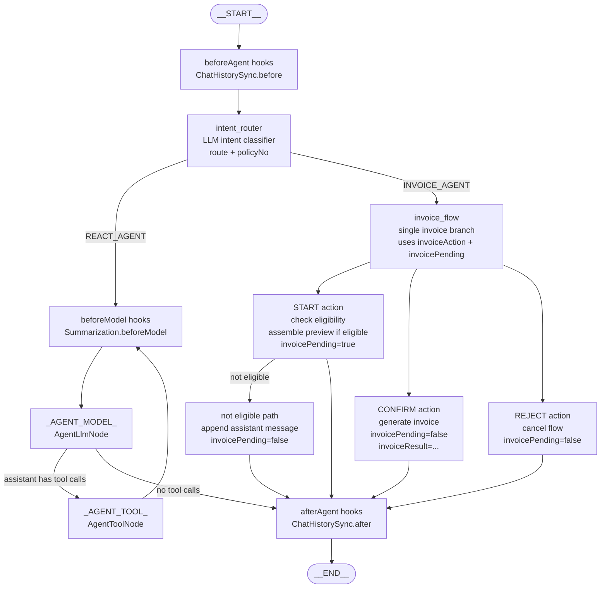

# InvoiceGraphAgent Graph Diagram

## State Keys

- `messages`: appended through the same graph state as ReactAgent.
- `route`: replaced on every intent routing pass. Only `REACT_AGENT` or `INVOICE_AGENT`.
- `invoiceAction`: replaced on every invoice routing pass. `START`, `CONFIRM`, or `REJECT`.
- `policyNo`: extracted by the LLM router or carried from pending invoice state.
- `eligibility`: mocked policy invoice eligibility result.
- `invoicePending`: `true` after preview, `false` after generate/reject/not eligible.
- `invoicePreview`: mocked invoice preview data stored in graph state.
- `invoiceResult`: mocked generated invoice data stored in graph state.
