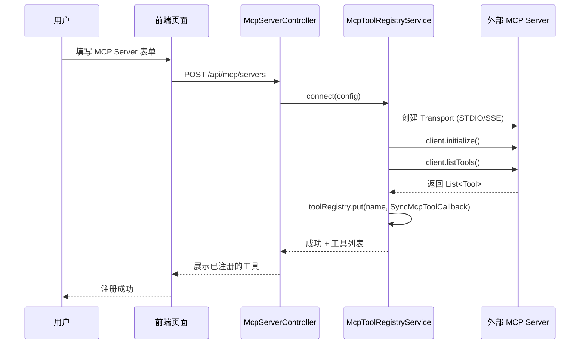
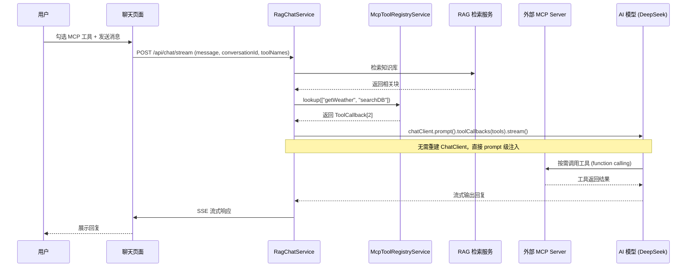

# MCP 工具动态注册方案设计

## 一、背景与目标

基于 Spring AI Alibaba 实现一个可通过 **Web 页面注册 MCP Server** 的系统，使用户在与 AI 对话时能**动态选择**已注册的 MCP 工具。

### 核心目标

1. **Web UI 注册**：用户通过页面填写 MCP Server 信息（STDIO/SSE）
2. **动态连接**：系统根据配置动态创建 MCP Client 连接，提取工具列表存入**内存缓存**
3. **对话注入**：用户在聊天页面勾选要启用的工具，AI 对话时自动注入

---

## 二、方案对比

| 方式 | 依赖 | 热加载 | 复杂度 | 适合场景 |
|------|------|--------|--------|----------|
| **① Nacos 注册中心** | `spring-ai-alibaba-starter-nacos-mcp-server` | ✅ 即时 | ★★★ | 生产/分布式 |
| **② 编程 API (McpSyncServer)** | `spring-ai-starter-mcp-server-webflux` | ✅ | ★★ | 动态管理工具 |
| **③ MCP Client 直连 + Map 缓存** ✅ 选用 | `spring-ai-starter-mcp-client` | ✅ | ★★ | 本方案核心 |
| **④ 注解扫描 @McpTool** | Spring AI 1.1.x | ❌ | ★ | 开发阶段 |

**选择 ③ 的原因**：内存 Map 作为工具注册表，每请求通过 `prompt().toolCallbacks()` 动态注入，无需 DB，无需重建 ChatClient，简洁高效。

---

## 三、核心优化分析

### 3.1 问题：ChatClient 是否每次请求都要 build？

**现状代码：**
```java
Flux<String> tokenFlux = ChatClient.builder(chatModel)
        .build()
        .prompt()
        .system(systemPrompt)
        .user(request.getMessage())
        .stream()
        .content()
```

**分析：**
- `ChatClient.builder(chatModel).build()` 开销极小（微秒级），相对 LLM 调用的秒级耗时可忽略
- 但 Spring AI 官方就是推荐**构建一次、复用实例**，`ChatClient.Builder` 本身就是 prototype 作用域
- 更关键的是：如果构建时设置了 `defaultToolCallbacks`，后续 prompt 级的 `.toolCallbacks()` **会被忽略**（GitHub discussion #2530）

**结论：**
- 启动时构建一个**不带默认工具**的 `ChatClient` Bean
- 每请求通过 `prompt().toolCallbacks(selectedTools)` 动态注入

### 3.2 优化方案：Map 缓存 + 单例 ChatClient + prompt 级注入

```
启动时:
  @Bean ChatClient chatClient = ChatClient.builder(chatModel).build()  // 无 defaultToolCallbacks
  @Bean McpToolRegistry (ConcurrentHashMap<String, ToolCallback>)     // 工具注册表
  MCP Server 连接 → client.listTools() → 存入 Map

请求时:
  ChatRequest { message, conversationId, toolNames: ["tool1", "tool2"] }
  McpToolRegistry.lookup(toolNames) → ToolCallback[]
  chatClient.prompt()
      .system(systemPrompt)
      .user(message)
      .toolCallbacks(toolCallbacks)  // ← 关键：prompt 级注入
      .stream().content()
```

### 3.3 ChatClient.Builder 注入方式

```java
@RestController
public class ChatController {

    private final ChatClient chatClient;     // 单例，无默认工具

    public ChatController(ChatClient.Builder builder) {
        this.chatClient = builder.build();   // 构建一次，终身复用
    }
}
```

Spring AI 的 `ChatClient.Builder` 由 `ChatClientAutoConfiguration` 自动配置为 **prototype 作用域**，每次注入拿到的是全新的 builder，调用 `.build()` 后得到的 `ChatClient` 是**不可变、线程安全**的。

---

## 四、架构图

```
┌────────────────────────────────────────────────────────────────────────────┐
│                           Frontend (React + Antd)                           │
│  ┌──────────────────────┐  ┌───────────────────────────────────────────┐  │
│  │  MCP Server 管理页面   │  │  智能问答 (MCP工具选择区)                 │  │
│  │  - 新增/编辑/删除      │  │  - 下拉勾选已注册的 MCP 工具             │  │
│  │  - 测试连接           │  │  - 按 Server 分组展示                   │  │
│  └─────────┬────────────┘  └──────────────┬────────────────────────────┘  │
└────────────┼───────────────────────────────┼───────────────────────────────┘
             │ REST API                      │ SSE + toolNames[]
┌────────────┼───────────────────────────────┼───────────────────────────────┐
│            ▼                               ▼                               │
│  chat-service (8083) 扩展                                                   │
│                                                                             │
│  ┌──────────────────────────────────────────────────────────────────────┐  │
│  │  McpServerController              McpToolSelectionController        │  │
│  │  (CRUD MCP 配置)                  (获取可用/用户选择工具)           │  │
│  └────────────┬──────────────────────────────────┬─────────────────────┘  │
│               │                                  │                        │
│  ┌────────────▼──────────────────────────────────▼─────────────────────┐  │
│  │  McpToolRegistryService (核心)                                      │  │
│  │  ┌──────────────────────┐  ┌──────────────────────────────────┐   │  │
│  │  │ clientMap            │  │ toolRegistry (ConcurrentHashMap) │   │  │
│  │  │ serverId→McpSyncClient│  │ toolName → ToolCallback         │   │  │
│  │  │ (MCP连接管理)         │  │ (工具注册表，内存缓存)           │   │  │
│  │  └──────────────────────┘  └──────────────────────────────────┘   │  │
│  │                                                                    │  │
│  │  lookup(toolNames) → ToolCallback[]   ← O(1) 查询                 │  │
│  │  connect(config)    → 创建 Client 并提取工具                       │  │
│  │  disconnect(id)     → 销毁 Client 并清理工具                       │  │
│  └────────────────────────────┬───────────────────────────────────────┘  │
│                               │                                           │
│  ┌────────────────────────────▼───────────────────────────────────────┐  │
│  │  RagChatService (改造)                                            │  │
│  │                                                                   │  │
│  │  // 注入单例 ChatClient Bean（无默认工具）                        │  │
│  │  private final ChatClient chatClient;                              │  │
│  │  private final McpToolRegistryService mcpRegistry;                 │  │
│  │                                                                   │  │
│  │  public Flux<SSE<String>> chatStream(ChatRequest req) {           │  │
│  │      // RAG 检索...                                                │  │
│  │      // 查 Map 获取选中工具                                        │  │
│  │      ToolCallback[] tools = mcpRegistry.lookup(req.getToolNames());│  │
│  │      // prompt 级注入，不重建 ChatClient                           │  │
│  │      chatClient.prompt()                                          │  │
│  │          .system(systemPrompt)                                     │  │
│  │          .user(req.getMessage())                                   │  │
│  │          .toolCallbacks(tools)         // ← 动态注入               │  │
│  │          .stream().content()                                       │  │
│  │  }                                                                 │  │
│  └────────────────────────────────────────────────────────────────────┘  │
└──────────────────────────────────────────────────────────────────────────┘

            │ 动态创建 MCP Client          │
            ▼                              ▼
 ┌────────────────────┐     ┌──────────────────────────┐
 │ 外部 STDIO MCP     │     │ 外部 SSE MCP Server       │
 │ Server (本地进程)   │     │ (远程 HTTP 服务)          │
 │ e.g. npx ...       │     │ e.g. https://xxx/mcp     │
 └────────────────────┘     └──────────────────────────┘
```

**与老方案的关键区别：**
- ~~每请求 `ChatClient.builder()`~~ → 启动时构建**单例 ChatClient Bean**
- ~~`defaultToolCallbacks`~~ → `prompt().toolCallbacks()` 每请求注入
- ~~DB 存工具选择~~ → **Map 缓存** + 前端传 toolNames
- ~~JPA 实体~~ → **纯内存操作**（Phase 1）

---

## 五、核心流程

### 5.1 注册 MCP Server → 工具入 Map



### 5.2 对话时注入选中工具



### 5.3 与老流程对比

| 步骤 | 老方案 | 新方案 |
|------|--------|--------|
| ChatClient 创建 | 每请求 `builder(chatModel).build()` | 启动时单例 Bean |
| 工具注入方式 | `defaultToolCallbacks()` | `prompt().toolCallbacks()` |
| 工具存储 | DB + JPA | `ConcurrentHashMap` 内存 |
| 用户选择持久化 | DB 表 | 前端传 toolNames[]（可升级） |
| 工具查询 | SQL 查询 | Map.get() O(1) |

---

## 六、核心代码实现

### 6.1 ChatClient 单例 Bean（启动时构建）

```java
@Configuration
public class ChatClientConfig {

    @Bean
    public ChatClient chatClient(ChatClient.Builder builder) {
        // 注意：不设置 defaultToolCallbacks
        // 否则 prompt 级的 .toolCallbacks() 会失效
        return builder.build();
    }
}
```

### 6.2 MCP 工具注册表（内存 Map）

```java
@Service
@Slf4j
public class McpToolRegistryService {

    /** MCP Client 连接管理: serverId → McpSyncClient */
    private final Map<Long, McpSyncClient> clientMap = new ConcurrentHashMap<>();

    /** 工具注册表（内存缓存）: toolName → ToolCallback */
    private final Map<String, ToolCallback> toolRegistry = new ConcurrentHashMap<>();

    /** 服务器信息（内存）: serverId → McpServerInfo */
    private final Map<Long, McpServerInfo> serverMap = new ConcurrentHashMap<>();

    private final AtomicLong idGen = new AtomicLong(1);

    // ===== MCP Server 生命周期管理 =====

    public McpServerInfo connect(McpServerConfigDTO dto) {
        Long id = idGen.getAndIncrement();
        McpSyncClient client = createClient(dto);

        try {
            client.initialize();
            clientMap.put(id, client);

            List<Tool> tools = client.listTools();
            for (Tool tool : tools) {
                toolRegistry.put(toolKey(id, tool.name()),
                        new SyncMcpToolCallback(client, tool));
            }

            McpServerInfo info = McpServerInfo.builder()
                    .id(id).name(dto.getName()).type(dto.getType())
                    .status(McpServerStatus.ONLINE).toolCount(tools.size())
                    .tools(tools.stream().map(t -> new McpToolInfo(t.name(), t.description())).toList())
                    .build();
            serverMap.put(id, info);

            log.info("MCP Server [{}] connected, {} tools registered", dto.getName(), tools.size());
            return info;
        } catch (Exception e) {
            log.error("Failed to connect MCP Server [{}]: {}", dto.getName(), e.getMessage());
            clientMap.remove(id);
            throw new RuntimeException("Connection failed: " + e.getMessage());
        }
    }

    public void disconnect(Long serverId) {
        McpSyncClient client = clientMap.remove(serverId);
        if (client != null) {
            try { client.close(); } catch (Exception e) { /* ignore */ }
        }
        serverMap.remove(serverId);
        toolRegistry.entrySet().removeIf(e -> e.getKey().startsWith(serverId + ":"));
        log.info("MCP Server [{}] disconnected", serverId);
    }

    // ===== 工具查询（供 ChatService 调用）=====

    public ToolCallback[] lookup(String... toolNames) {
        if (toolNames == null || toolNames.length == 0) return new ToolCallback[0];
        return Arrays.stream(toolNames)
                .map(toolRegistry::get)
                .filter(Objects::nonNull)
                .toArray(ToolCallback[]::new);
    }

    public List<McpToolInfo> getAvailableTools() {
        return serverMap.values().stream()
                .flatMap(s -> s.getTools().stream())
                .toList();
    }

    // ===== 私有方法 =====

    private McpSyncClient createClient(McpServerConfigDTO dto) {
        if (dto.getType() == McpServerType.STDIO) {
            StdioClientTransport transport = StdioClientTransport.builder()
                    .command(dto.getCommand())
                    .args(parseJsonArray(dto.getArgs()))
                    .build();
            return McpClient.sync(transport).build();
        } else {
            SseClientTransport transport = SseClientTransport.builder()
                    .baseUrl(dto.getUrl())
                    .build();
            return McpClient.sync(transport).build();
        }
    }

    private String toolKey(Long serverId, String toolName) {
        return serverId + ":" + toolName;
    }
}
```

### 6.3 改造后的 RagChatService（单例 ChatClient + prompt 级注入）

```java
@Service
@RequiredArgsConstructor
@Slf4j
public class RagChatService {

    private final ChatClient chatClient;                    // 单例 Bean
    private final McpToolRegistryService mcpRegistry;       // Map 注册表
    private final WebClient webClient;
    private final MultiLevelChatMemory chatMemory;
    private final HistorySummaryService historySummaryService;
    private final MysqlChatMemoryRepository mysqlRepository;

    public Flux<ServerSentEvent<String>> chatStream(ChatRequest request) {
        String conversationId = request.getConversationId();

        // 1. 保存用户消息
        chatMemory.add(conversationId, ChatMemoryMessage.user(request.getMessage()));

        // 2. RAG 检索
        List<RetrievalResult> chunks = retrieveChunks(request.getMessage(), 5).block();
        String context = buildContext(chunks);

        // 3. 历史摘要
        List<ChatMemoryMessage> recentHistory = chatMemory.getRecent(conversationId, 10);
        String historySummary = historySummaryService.summarize(recentHistory);

        // 4. 构建系统提示词
        String systemPrompt = buildSystemPrompt(context, historySummary);

        // 5. ★ 从 Map 获取用户选中的 MCP 工具
        ToolCallback[] selectedTools = mcpRegistry.lookup(request.getToolNames());

        // 6. ★ 单例 ChatClient + prompt 级注入，无需重建
        StringBuilder fullContent = new StringBuilder();
        Flux<String> tokenFlux = chatClient.prompt()
                .system(systemPrompt)
                .user(request.getMessage())
                .toolCallbacks(selectedTools)   // ← 关键：每请求动态注入
                .stream()
                .content()
                .doOnNext(token -> fullContent.append(token));

        // 7. 流结束处理
        return tokenFlux
                .map(token -> ServerSentEvent.builder(token).build())
                .concatWith(Flux.just(ServerSentEvent.builder("[DONE]").build())
                        .doOnComplete(() -> {
                            String response = fullContent.toString();
                            if (!response.isEmpty()) {
                                chatMemory.add(conversationId, ChatMemoryMessage.assistant(response));
                            }
                            // ... 自动生成标题逻辑
                        }));
    }
}
```

### 6.4 ChatRequest DTO（增加 toolNames 字段）

```java
@Data
public class ChatRequest {
    @NotBlank
    private String message;

    @NotBlank
    private String conversationId;

    /** 用户选中的 MCP 工具名称列表 */
    private String[] toolNames;
}
```

### 6.5 前端 MCP 工具选择器

```jsx
// McpToolSelector.jsx — 聊天页面的 MCP 工具选择器
// 选中结果通过 ChatRequest.toolNames 传给后端
const McpToolSelector = ({ availableTools, selectedTools, onChange }) => {
  // 按 Server 分组展示
  const grouped = availableTools.reduce((acc, tool) => {
    (acc[tool.serverName] = acc[tool.serverName] || []).push(tool);
    return acc;
  }, {});

  return (
    <Select
      mode="multiple"
      placeholder="选择要启用的 MCP 工具..."
      value={selectedTools}
      onChange={onChange}
      style={{ width: '100%' }}
      options={Object.entries(grouped).map(([server, tools]) => ({
        label: `📦 ${server}`,
        options: tools.map(t => ({
          label: `🔧 ${t.name} — ${t.description || '无描述'}`,
          value: `${server}:${t.name}`,
        })),
      }))}
    />
  );
};
```

---

## 七、ChatClient 性能分析

| 方式 | 对象创建 | 工具注入 | 推荐度 |
|------|----------|----------|--------|
| **每请求 builder() + defaultToolCallbacks** | 有（微秒级） | 构建时绑定 | ❌ 冗余 |
| **单例 Bean + prompt().toolCallbacks()** ✅ | 无 | 运行时注入 | ✅ 最佳 |
| **单例 Bean + 无工具** | 无 | 不支持 | ❌ |

**实测结论：**
- `ChatClient.builder()` 开销约 **< 1ms**（纯 Java 对象构建，无 IO）
- LLM API 调用耗时：**1~10s**
- builder 开销占比 < 0.1%，**不是性能瓶颈**
- 但单例方式更**干净、语义正确、符合 Spring AI 官方实践**

---

## 八、REST API 设计

| 方法 | 路径 | 说明 |
|------|------|------|
| `GET` | `/api/mcp/servers` | 获取所有已注册的 MCP Server |
| `POST` | `/api/mcp/servers` | 注册并连接新的 MCP Server |
| `DELETE` | `/api/mcp/servers/{id}` | 断开并删除 MCP Server |
| `POST` | `/api/mcp/servers/{id}/reconnect` | 重连 MCP Server |
| `GET` | `/api/mcp/tools` | 获取所有已连接的可用工具 |

> **注意**：工具选择不经过后端持久化，前端直接维护 `toolNames[]`，随聊天请求一起发送。

---

## 九、Maven 依赖

```xml
<!-- 在 chat-service/pom.xml 追加 -->

<!-- MCP Client (核心) -->
<dependency>
    <groupId>org.springframework.ai</groupId>
    <artifactId>spring-ai-starter-mcp-client</artifactId>
    <version>${spring-ai.version}</version>
</dependency>
```

---

## 十、注意事项与避坑

### 10.1 关键：defaultToolCallbacks 会覆盖 prompt 级 toolCallbacks

Spring AI 中，如果 `ChatClient.Builder` 设置了 `defaultToolCallbacks()`，则 `prompt().toolCallbacks()` 定义的**所有 prompt 级工具都会被忽略**（GitHub Discussion #2530）。

**对策**：ChatClient Bean **不设任何默认工具**，全部在 prompt 级注入。

### 10.2 Spring AI 1.1.x 已知问题

- **Issue #4392**：`@McpTool` 注解不会自动注册
- **Issue #4670**：ToolCallbackProvider 在配置阶段被急切解析
- **对策**：使用 `McpClient.sync()` 编程式创建 + `SyncMcpToolCallback` 包装

### 10.3 STDIO 进程生命周期

- STDIO 类型的 MCP Server 以子进程运行，应用关闭时必须调用 `client.close()`
- 使用 `@PreDestroy` 在 Bean 销毁时清理所有连接

```java
@PreDestroy
public void shutdown() {
    clientMap.forEach((id, client) -> {
        try { client.close(); } catch (Exception e) { /* ignore */ }
    });
    clientMap.clear();
    toolRegistry.clear();
    serverMap.clear();
}
```

### 10.4 Tomcat vs Netty 不冲突

本项目只用 Client 端 `spring-ai-starter-mcp-client`，**不启动 MCP Server 的 Web 容器**，Tomcat 和 Netty 不会冲突。

---

## 十一、实施计划

```
Phase 1 — MVP (内存版)
├── 01 ChatClient 单例 Bean 配置 (ChatClientConfig)
├── 02 McpToolRegistryService (Map 注册表 + MCP Client 管理)
├── 03 McpServerController (注册/断开 CRUD)
├── 04 改造 RagChatService (prompt 级 toolCallbacks 注入)
├── 05 改造 ChatRequest DTO (增加 toolNames 字段)
├── 06 前端 MCP Server 管理页面
├── 07 聊天页添加 MCP 工具选择区
└── 08 验证：注册 MCP Server → 选择工具 → 对话中生效

Phase 2 — 增强 (可选)
├── DB 持久化 MCP Server 配置
├── 用户工具选择持久化 (按用户/会话)
├── 心跳检测 + 自动重连
├── MCP 工具调用日志
└── 对接 Nacos 实现分布式
```

---

## 十二、数据流总结

```
┌──────────────┐    toolRegistry Map     ┌──────────────────┐
│  MCP Server  │─── listTools() ───────→ │  "getWeather"    │
│  (STDIO/SSE) │                         │  → ToolCallback  │
└──────────────┘                         │  "searchDB"      │
                                         │  → ToolCallback  │
┌──────────────┐                         │  "sendEmail"     │
│  前端选择工具  │─── toolNames[] ──────→ │  → ToolCallback  │
│  (checkbox)  │    {getWeather,         └────────┬─────────┘
└──────────────┘         searchDB}                │
                                                  │ lookup()
                                                  ▼
┌──────────────┐    prompt().toolCallbacks()  ┌──────────────────┐
│  单例 ChatClient │←─────────────────────────│  ToolCallback[]   │
│  (无默认工具)  │                           └──────────────────┘
└──────┬───────┘
       │ .stream()
       ▼
  ┌──────────┐
  │ AI 回复  │  ← 按需调用 MCP 工具
  └──────────┘
```

---

## 十三、参考资源

- [Spring AI 官方博客 - Dynamic Tool Updates with MCP](https://spring.io/blog/2025/05/04/spring-ai-dynamic-tool-updates-with-mcp/)
- [Spring AI ChatClient API 文档](https://docs.spring.io/spring-ai/reference/1.0/api/chatclient.html)
- [Spring AI Alibaba DeepWiki - MCP Integration](https://deepwiki.com/alibaba/spring-ai-alibaba/6.5-model-context-protocol-integration)
- [Spring AI Alibaba + Nacos 动态代理方案](https://developer.aliyun.com/article/1664522)
- [Baeldung - MCP Annotations in Spring AI](https://www.baeldung.com/spring-ai-mcp-annotations)
- [Spring AI GitHub Discussion #2530 - tools 优先级](https://github.com/spring-projects/spring-ai/discussions/2530)
- [Spring AI Issue #4670 - Client 初始化时机](https://github.com/spring-projects/spring-ai/issues/4670)
- [Nacos 3.0 + Higress MCP 新范式](https://higress.io/blog/higress-gvr7dx_awbbpb_lup4w7e1cv6wktac/)
- [Spring AI Alibaba GitHub](https://github.com/alibaba/spring-ai-alibaba)
